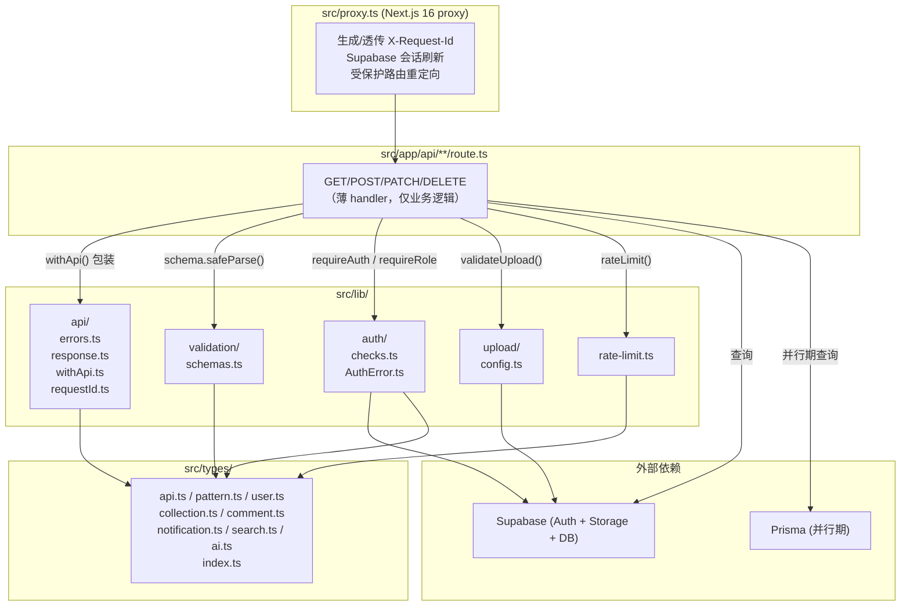

# Design Document

## Overview

Phase 0 的设计目标是为 HBPattern 建立"API / 权限 / 校验 / 上传 / 限流"这五条骨架的单一真相源，消灭 `CODE_REVIEW_AND_ARCHITECTURE_PLAN.md` §1.2 的 4 个 Critical_Bug，并让所有 Route_Handler 以"组合这些骨架"的方式编写，而不是各自内联实现。

本设计遵循以下指导原则：

- **单一真相源 (Single Source of Truth)**：错误码、错误→HTTP 映射、上传配额、限流配额、领域类型、Footer 组件各自只有一处定义；所有 Route_Handler 消费这些常量与辅助函数。
- **组合优于继承 / 显式优于隐式**：提供一个薄 Route_Handler 包装器 `withApi()`，负责三件事 —— 生成 Request_Id、捕获异常映射为统一错误、写入 `X-Request-Id` Header。业务逻辑不感知这三件事的存在。
- **Next.js 16 原生契约**：动态路由 `params` 统一按 `Promise<T>` 处理；`proxy.ts`（Next.js 16 对 middleware 的重命名）负责跨切面职责中"必须运行在 Node 运行时之前"的部分，其余保持在 Route_Handler 包装器中，以便类型信息完整且易于单测。
- **Phase 0 不越界**：不启用 Zustand / TanStack Query（ADR #3），不迁移 Prisma ↔ Supabase（ADR #1），不替换 Auth 栈（ADR #2），不引入 Redis。限流、日志、requestId 均为进程内实现，留好 Phase 3+ 切换接口。
- **零警告清零成本**：所有新增模块均以纯 TypeScript + 现有 ESLint 规则通过；`npm run build` / `npm run lint` 必须保持零 error、零 warning。

### 研究要点与依赖来源

设计前对以下外部事实进行核对（均已在本仓库直接验证，未引入新版本猜测）：

- **Next.js 16.2 动态路由 `params`**：`package.json` 锁定 `next@16.2.1`；仓库中现有 `src/app/api/patterns/[id]/route.ts`、`src/app/gallery/[id]/page.tsx` 已使用 `params: Promise<{ id: string }>` 签名，证实 Promise 形态是 Next.js 16 的契约。AGENTS.md 明确要求在编写 Next.js 代码前阅读 `node_modules/next/dist/docs/`；本仓库目前未安装 `node_modules`，因此本设计的 API 表面仅使用已在源码中被实际使用过的 Next.js 16 形态（`NextRequest`、`NextResponse`、`Promise<params>`），不引入任何未经过仓库验证的新语法。
- **Next.js 16 的 `proxy.ts` 重命名**：仓库中已存在 `src/proxy.ts`（Supabase 会话校验），这是 Next.js 16 对原 `middleware.ts` 的重命名。Request_Id 生成与 `X-Request-Id` 传播将复用这一 `proxy.ts` 入口，不再新增 `middleware.ts`。
- **`crypto.randomUUID()`**：Node 19+ 与现代浏览器均原生提供，可在 Route_Handler / proxy 中直接调用生成 UUID v4，无需额外依赖。
- **Zod**：`package.json` 当前尚未声明 `zod`，Requirement 3.1 要求把它列为生产依赖。本设计假设执行阶段将执行 `npm install zod`。
- **Supabase Auth 客户端**：`src/lib/supabase/server.ts` 提供 `createClient()` 异步工厂，`Auth_Layer` 会在此之上薄层封装，不触及 Supabase SSR 协议本身。

---

## Architecture

### 模块分层

Phase 0 在 `src/lib/` 下新增五组基础模块，`src/types/` 下补齐领域类型模块，`src/app/api/**/route.ts` 的 Route_Handler 全部改为"薄 Handler + 组合调用"的形态。



### Route_Handler 组合模型

每个 Route_Handler 的"标准形态"是下述五步的固定顺序，由 `withApi()` 包装器与开发者手写逻辑协同完成：

1. **Request_Id 生成 / 透传** —— 由 `withApi()` 在入口处完成（若 proxy 已注入则透传，否则现场生成）。
2. **Zod `safeParse`** —— 开发者在函数体第一行调用对应 schema；失败立即 `throw` 一个 `ValidationError`（下面会看到它是 `AppError` 的子类），由 `withApi()` 统一映射为 400。
3. **鉴权 / 角色检查** —— 调用 `requireAuth()` / `requireRole(...)`；失败抛 `AuthError`，由 `withApi()` 映射为 401/403。
4. **限流 / 上传校验**（按需）—— `await rateLimit(...)` / `validateUpload(...)`；失败抛 `RateLimitError` / 对应 `AppError`。
5. **业务逻辑** —— 返回 `ok(data)` 或 `okList(items, pagination)`，由 `withApi()` 包成最终 `Response` 并附上 `meta` / `X-Request-Id`。

错误永远通过 `throw` 而不是"返回错误 Response"传出 —— 这样 `withApi()` 是唯一把业务结果转成 HTTP 的地方，Requirement 2 的契约（错误 envelope、状态码映射、日志、header）只在一处实现。

### 错误到 HTTP 映射的单一真相源

`src/lib/api/errors.ts` 导出一张静态映射表 `ERROR_CODE_TO_STATUS: Record<ApiErrorCode, HttpStatus>`，并据此派生出 `codeToStatus(code)` 辅助。任何抛出的 `AppError` 都必须携带 `code: ApiErrorCode`；`withApi()` 在 catch 分支调用 `codeToStatus(code)` 得到最终状态。这样 Requirement 2.7 的映射表（400/401/403/404/409/413/415/429/500）在代码里是"表驱动"的，而不是散落在各 Route_Handler 的字面量里。

### Request_Id 生成与传播策略

**结论：采用"proxy 生成 + withApi 兜底"的双层策略。**

理由：

- **proxy 生成**优势在于所有请求（包括页面 SSR、静态资源未命中时的 fallback、Route_Handler）都能得到统一 ID，便于把前端 SSR 日志与后端 API 日志关联。但 Next.js 16 的 proxy 在某些路径（matcher 排除的 `_next/static` 等）不会执行，且 proxy 把 header 写回的方式依赖 `NextResponse.next({ request, headers })` 而不是响应 header（响应 header 必须在 Route_Handler 里最终决定）。
- **withApi 兜底**优势在于"Route_Handler 自己可以独立工作"——即便 proxy 没跑（例如本地单测直接调 `GET()` 函数），requestId 仍然会生成。

具体协议：

1. `src/proxy.ts` 在 `matcher` 命中时，读取入站 `x-request-id` header；若不存在或格式非法则生成 `crypto.randomUUID()`，写入 `request.headers` 并放入 `NextResponse.next({ request })`。
2. `withApi()` 在 handler 入口从 `request.headers.get('x-request-id')` 读取；若仍为空（非 proxy 路径），调用 `crypto.randomUUID()` 生成。
3. `withApi()` 在返回响应前把 `requestId` 写入：
   - 响应 Header `X-Request-Id`
   - JSON 响应体的 `meta.requestId`（成功）或 `error.requestId`（失败）
4. 结构化日志在 `withApi()` 的 try/catch 中使用同一 `requestId`。

这样 Requirement 2.4 / 2.11 的"响应体与 header 中 requestId 一致"是结构性保证，而不是人工纪律。

### proxy.ts 的职责边界

`src/proxy.ts` 现已承担 Supabase 会话刷新与受保护路由重定向。Phase 0 对它的唯一扩展是：在现有逻辑之前插入 Request_Id 的读取 / 生成，并通过 `request.headers.set('x-request-id', requestId)` 向下游透传。其他一切（鉴权、限流、校验）仍留在 Route_Handler，因为这些决策需要路由级上下文（期望的 schema、允许的角色、配额键），不适合在 proxy 全局处理。

---

## Components and Interfaces

本节给出每个新增模块的具体文件位置、导出 API 和 TypeScript 签名。所有签名均可在后续实现任务中直接落地。

### 1. `src/lib/api/` — 统一 API 响应与错误

#### `src/lib/api/errors.ts`

```ts
/** 业务错误码字面量联合。新增错误码必须同时更新 ERROR_CODE_TO_STATUS。 */
export type ApiErrorCode =
  | 'VALIDATION_ERROR'
  | 'BAD_REQUEST'
  | 'UNAUTHORIZED'
  | 'FORBIDDEN'
  | 'NOT_FOUND'
  | 'PATTERN_NOT_FOUND'
  | 'CONFLICT'
  | 'FILE_TOO_LARGE'
  | 'UNSUPPORTED_MEDIA_TYPE'
  | 'RATE_LIMIT_EXCEEDED'
  | 'INTERNAL_ERROR'

export type HttpStatus = 400 | 401 | 403 | 404 | 409 | 413 | 415 | 429 | 500

/** Requirement 2.7 的单一真相表。 */
export const ERROR_CODE_TO_STATUS: Record<ApiErrorCode, HttpStatus> = {
  VALIDATION_ERROR: 400,
  BAD_REQUEST: 400,
  UNAUTHORIZED: 401,
  FORBIDDEN: 403,
  NOT_FOUND: 404,
  PATTERN_NOT_FOUND: 404,
  CONFLICT: 409,
  FILE_TOO_LARGE: 413,
  UNSUPPORTED_MEDIA_TYPE: 415,
  RATE_LIMIT_EXCEEDED: 429,
  INTERNAL_ERROR: 500,
}

export function codeToStatus(code: ApiErrorCode): HttpStatus {
  return ERROR_CODE_TO_STATUS[code]
}

/** 业务异常基类。所有 Route_Handler 内部只 throw AppError 或其子类。 */
export class AppError extends Error {
  readonly code: ApiErrorCode
  readonly details?: unknown
  /** 可选 Header（如 429 的 Retry-After）。 */
  readonly headers?: Readonly<Record<string, string>>
  constructor(code: ApiErrorCode, message: string, opts?: {
    details?: unknown
    headers?: Record<string, string>
    cause?: unknown
  }) {
    super(message, { cause: opts?.cause })
    this.code = code
    this.details = opts?.details
    this.headers = opts?.headers
  }
}

export class ValidationError extends AppError {
  constructor(message: string, details?: unknown) {
    super('VALIDATION_ERROR', message, { details })
  }
}

export class RateLimitError extends AppError {
  constructor(retryAfterSec: number, message = '请求过于频繁，请稍后再试') {
    super('RATE_LIMIT_EXCEEDED', message, {
      headers: { 'Retry-After': String(Math.max(1, Math.ceil(retryAfterSec))) },
    })
  }
}
```

#### `src/lib/api/response.ts`

```ts
import type { ApiErrorCode } from './errors'

/** Response_Meta：Requirement 2.8 / 2.9 */
export interface ResponseMeta {
  requestId: string
  timestamp: string // ISO 8601
}

/** Pagination_Meta：Requirement 2.8 */
export interface PaginationMeta {
  page: number
  limit: number
  total: number
  totalPages: number
  hasNext: boolean
  hasPrev: boolean
}

export interface ApiSuccess<T> {
  data: T
  meta: ResponseMeta
}

export interface PaginatedResponse<T> {
  data: T[]
  pagination: PaginationMeta
  meta: ResponseMeta
}

export interface ApiError {
  error: {
    code: ApiErrorCode
    message: string
    requestId: string
    details?: unknown
  }
}

/** 构造单资源 200/201 响应体（不含 HTTP 封装，由 withApi 负责）。 */
export function ok<T>(data: T): { kind: 'ok'; data: T }

/** 构造分页列表 200 响应体。 */
export function okList<T>(
  items: T[],
  pagination: Pick<PaginationMeta, 'page' | 'limit' | 'total'>,
): { kind: 'okList'; items: T[]; pagination: PaginationMeta }

/**
 * 构造错误响应。Route_Handler 通常不直接调用此函数，
 * 而是 throw AppError / AuthError；fail() 用于 withApi 内部以及少数
 * 不希望抛异常的边界场景（如 Requirement 2.10.a：业务逻辑内显式返回 500）。
 */
export function fail(
  code: ApiErrorCode,
  message: string,
  opts?: { details?: unknown; headers?: Record<string, string> },
): { kind: 'fail'; code: ApiErrorCode; message: string; details?: unknown; headers?: Record<string, string> }
```

`ok` / `okList` / `fail` 返回的是中间载荷对象（携带 `kind` 判别）；真正的 `Response` 由 `withApi()` 统一构造。这样保证 `meta.requestId` 与 header `X-Request-Id` 一定相同（由同一处代码填充），Requirement 2.11 结构性满足。

#### `src/lib/api/requestId.ts`

```ts
const UUID_V4_RE = /^[0-9a-f]{8}-[0-9a-f]{4}-4[0-9a-f]{3}-[89ab][0-9a-f]{3}-[0-9a-f]{12}$/i

/** 读取入站 X-Request-Id；非法则回退到生成一个新的 UUID v4。 */
export function resolveRequestId(headers: Headers): string {
  const incoming = headers.get('x-request-id')
  if (incoming && UUID_V4_RE.test(incoming)) return incoming
  return crypto.randomUUID()
}
```

#### `src/lib/api/withApi.ts`

```ts
import type { NextRequest } from 'next/server'
import { NextResponse } from 'next/server'
import { AppError, codeToStatus, type ApiErrorCode } from './errors'
import { resolveRequestId } from './requestId'
import type { ApiError, ApiSuccess, PaginatedResponse } from './response'

/** 业务 handler 可返回的形状，由 ok/okList/fail 产生。 */
export type HandlerResult<T> =
  | { kind: 'ok'; data: T }
  | { kind: 'okList'; items: T[]; pagination: { page: number; limit: number; total: number } }
  | { kind: 'fail'; code: ApiErrorCode; message: string; details?: unknown; headers?: Record<string, string> }

/**
 * Route_Handler 包装器。
 *
 * - 负责：生成/透传 Request_Id；捕获 AppError 子类；统一写 X-Request-Id header；
 *   非 production 下透出 error.details；production 下丢弃 details（Requirement 2.5）。
 * - 不负责：读 body、解析 query、鉴权 —— 这些由被包装函数自己完成。
 *
 * Ctx 对应 Next.js 16 的第二个参数（含 `params: Promise<...>`）。
 */
export function withApi<T, Ctx = unknown>(
  handler: (req: NextRequest, ctx: Ctx) => Promise<HandlerResult<T>>,
): (req: NextRequest, ctx: Ctx) => Promise<NextResponse<ApiSuccess<T> | PaginatedResponse<T> | ApiError>>
```

运行时行为（纲要，非实现代码）：

1. `requestId = resolveRequestId(req.headers)`
2. `try { result = await handler(req, ctx) }`
3. 成功：根据 `result.kind` 构造 `ApiSuccess<T>` 或 `PaginatedResponse<T>` 响应体，填入 `meta = { requestId, timestamp: new Date().toISOString() }`，`status = result.kind === 'ok' && data=null ? 204 : 200`（单资源创建场景由 handler 自己在返回体中携带，必要时 `withApi` 暴露一个 `status` 字段覆盖 —— 见扩展签名）。
4. 失败（`AppError`）：`status = codeToStatus(err.code)`，响应体 `{ error: { code, message, requestId, details: env==='production' ? undefined : err.details } }`，把 `err.headers` 合并到响应 header。
5. 失败（任意其他 `Error`）：映射为 `INTERNAL_ERROR` / 500；`console.error({ requestId, name, message, stack })` 结构化输出到 stderr（Phase 0 仅落 stderr，Phase 3+ 接入集中日志）。
6. 在所有分支中设置响应 header `X-Request-Id: {requestId}`。

为了处理 201（`POST` 创建）等状态，`ok()` 的完整签名扩展为：

```ts
export function ok<T>(data: T, opts?: { status?: 200 | 201 | 204 }): { kind: 'ok'; data: T; status?: number }
```

`withApi()` 读取此 `status` 字段；默认 `ok()` ⇒ 200，`okList()` ⇒ 200。

---

### 2. `src/lib/validation/schemas.ts` — Zod 集中校验

按 Requirement 3.2 命名导出。所有 schema 均在此文件或其子模块中定义，Route_Handler 不得内联 `z.object(...)`。

```ts
import { z } from 'zod'

/** GET /api/patterns 的 query。 */
export const ListPatternsQuery = z.object({
  page: z.coerce.number().int().min(1).default(1),
  limit: z.coerce.number().int().min(1).max(50).default(12),
  era: z.string().trim().min(1).optional(),
  region: z.string().trim().min(1).optional(),
  sort: z.enum(['newest', 'oldest', 'popular', 'likes']).default('newest'),
  q: z.string().trim().min(1).max(100).optional(),
})
export type ListPatternsQueryInput = z.infer<typeof ListPatternsQuery>

/** POST /api/patterns 的 body。 */
export const CreatePatternBody = z.object({
  name: z.string().trim().min(1).max(100),
  description: z.string().trim().max(2000).optional(),
  era: z.string().trim().max(50).optional(),
  regionId: z.string().uuid().optional(),
  techniqueId: z.string().uuid().optional(),
  imageUrl: z.string().url(),
})
export type CreatePatternBodyInput = z.infer<typeof CreatePatternBody>

/** /api/patterns/[id] 的 path param。 */
export const PatternIdParam = z.object({
  id: z.string().uuid(),
})
export type PatternIdParamInput = z.infer<typeof PatternIdParam>

/** POST /api/upload 的 multipart form（仅校验 file 字段存在）。 */
export const UploadFileForm = z.object({
  file: z.instanceof(File, { message: '请选择文件' }),
})
export type UploadFileFormInput = z.infer<typeof UploadFileForm>

/** 未来 POST /api/patterns/:id/comments 的 body（Phase 0 预置）。 */
export const CreateCommentBody = z.object({
  content: z.string().trim().min(1).max(500),
  parentId: z.string().uuid().optional(),
})
export type CreateCommentBodyInput = z.infer<typeof CreateCommentBody>
```

**Route_Handler 的校验入口辅助**（放在 `src/lib/validation/parse.ts`，避免每个 handler 手写 `if (!result.success) throw new ValidationError(...)` 样板）：

```ts
import type { z } from 'zod'
import { ValidationError } from '@/lib/api/errors'

export function parseOrThrow<S extends z.ZodTypeAny>(
  schema: S,
  input: unknown,
  message = '请求参数校验失败',
): z.infer<S> {
  const r = schema.safeParse(input)
  if (!r.success) throw new ValidationError(message, r.error.issues)
  return r.data
}
```

调用约定：`const query = parseOrThrow(ListPatternsQuery, Object.fromEntries(new URL(req.url).searchParams))`。
这一行即满足 Requirement 3.4.b 所述"Route_Handler 第一行调用 `safeParse`"的唯一控制点，不得再在 handler 中对 `query`/`body` 进行冗余判空。

---

### 3. `src/lib/auth/` — 权限检查

#### `src/lib/auth/AuthError.ts`

```ts
import { AppError } from '@/lib/api/errors'

export class AuthError extends AppError {
  constructor(kind: 'UNAUTHORIZED' | 'FORBIDDEN', message?: string) {
    super(kind, message ?? (kind === 'UNAUTHORIZED' ? '请先登录' : '无权限'))
  }
  /** 便于调用方直接读取；等价于 codeToStatus(this.code)。 */
  get status(): 401 | 403 {
    return this.code === 'UNAUTHORIZED' ? 401 : 403
  }
}
```

#### `src/lib/auth/checks.ts`

```ts
import { createClient } from '@/lib/supabase/server'
import { AuthError } from './AuthError'
import type { Role } from '@/types/user'

export interface AuthedUser {
  id: string
  email: string | null
  role: Role // 默认 'user'，从 hp_users 表查得
}

/**
 * Requirement 5.2 / 5.3：获取当前用户，失败抛 UNAUTHORIZED。
 * 返回值一定非空，调用方无需再做存在性判断。
 */
export async function requireAuth(): Promise<AuthedUser>

/**
 * Requirement 5.4 / 5.5：先 requireAuth，再按 hp_users.role 校验。
 * 角色不匹配抛 FORBIDDEN。
 */
export async function requireRole(roles: ReadonlyArray<Role>): Promise<AuthedUser>
```

实现纲要：

- `requireAuth` 调 `await createClient()` 然后 `supabase.auth.getUser()`；若 `error || !data.user || !data.user.id` 抛 `new AuthError('UNAUTHORIZED')`。随后以一次 `hp_users.select('role').eq('id', user.id).single()` 读取角色并默认 `'user'`。
- `requireRole` 复用 `requireAuth` 的返回；若 `!roles.includes(user.role)` 抛 `new AuthError('FORBIDDEN')`。
- `AuthError` 继承 `AppError`，因此会被 `withApi()` 的统一 catch 分支处理，Requirement 2 的错误 envelope 自然满足。

Requirement 5.8.a 的过渡态（内联权限检查 + `// TODO(auth-layer):` 注释）在本设计中仅作为"Phase 0 合并节点之前的兼容窗口"记录，不在新增代码里出现。

---

### 4. `src/lib/upload/config.ts` — 上传安全校验

```ts
import { ValidationError, AppError } from '@/lib/api/errors'

export const UPLOAD_CONFIG = {
  /** Requirement 6.2 */
  maxSize: 10 * 1024 * 1024,
  /** Requirement 6.3 */
  allowedTypes: ['image/jpeg', 'image/png', 'image/webp'] as const,
  /** Requirement 6.4 */
  allowedExts: ['jpg', 'jpeg', 'png', 'webp'] as const,
} as const

export type AllowedMime = (typeof UPLOAD_CONFIG.allowedTypes)[number]
export type AllowedExt = (typeof UPLOAD_CONFIG.allowedExts)[number]

/**
 * Requirement 6.5：按固定顺序短路校验。任一步骤失败即立即抛错，
 * 不进入后续校验、不调用 Supabase Storage。
 * 顺序：size → mime → ext。
 */
export function validateUpload(file: File): void {
  // Step 1: size
  if (file.size > UPLOAD_CONFIG.maxSize) {
    throw new AppError('FILE_TOO_LARGE', `文件不得超过 ${UPLOAD_CONFIG.maxSize / 1024 / 1024}MB`)
  }
  // Step 2: mime
  if (!(UPLOAD_CONFIG.allowedTypes as readonly string[]).includes(file.type)) {
    throw new AppError('UNSUPPORTED_MEDIA_TYPE', '仅支持 JPEG / PNG / WebP 图片')
  }
  // Step 3: ext
  const ext = extractExt(file.name)
  if (!ext || !(UPLOAD_CONFIG.allowedExts as readonly string[]).includes(ext)) {
    throw new ValidationError('文件扩展名不在允许列表内')
  }
}

export function extractExt(filename: string): string {
  const i = filename.lastIndexOf('.')
  if (i < 0 || i === filename.length - 1) return ''
  return filename.slice(i + 1).toLowerCase()
}
```

三类错误→HTTP 的映射由 `ERROR_CODE_TO_STATUS` 自动得到（413 / 415 / 400），Requirement 6.6 / 6.7 / 6.8 自洽。

---

### 5. `src/lib/rate-limit.ts` — 进程内存限流

```ts
import { RateLimitError } from '@/lib/api/errors'

export interface RateLimitQuota {
  /** 窗口长度（秒）。Phase 0 全部使用 60。 */
  windowSec: number
  /** 该窗口内允许的最大请求数。 */
  max: number
}

/** Requirement 7.3：按路由+方法命名。 */
export const QUOTAS = {
  'POST /api/patterns': { windowSec: 60, max: 10 },
  'POST /api/upload': { windowSec: 60, max: 20 },
  'POST /api/patterns/[id]/comments': { windowSec: 60, max: 30 },
} as const satisfies Record<string, RateLimitQuota>

export type QuotaKey = keyof typeof QUOTAS

/**
 * Requirement 7.1 / 7.4 / 7.5 / 7.8：
 * - 进程内存计数，key = `${quota}:${subjectId}`，subjectId 由调用方传入
 *   （已登录：user.id；未登录：x-forwarded-for 首个 IP 或 'anonymous'）。
 * - 超配额抛 RateLimitError（含 Retry-After）。
 * - 当 env.RATE_LIMIT_DISABLED === '1'（测试态）则直接返回，不抛错（Req 7.5.b）。
 */
export function rateLimit(quota: QuotaKey, subjectId: string): void

/** 单测辅助：清空所有计数器。 */
export function __resetRateLimiterForTests(): void
```

实现纲要：

- 全局单例 `Map<string, { count: number; resetAt: number }>`，基于 `globalThis` 命名空间挂载以跨热重载保持（与 `src/lib/db.ts` 对 Prisma 的做法一致）。
- `rateLimit`：取当前 `now = Date.now()`；若 `entry` 不存在或 `now >= resetAt`，重置为 `{ count: 1, resetAt: now + windowSec*1000 }`；否则 `count++`；若 `count > max`，计算 `retryAfterSec = Math.ceil((resetAt - now) / 1000)` 并抛 `new RateLimitError(retryAfterSec)`。
- Requirement 7.5.a 的"偏差比例 ≤ 10%"在单实例进程内是 0%；多实例漂移不由 Phase 0 代码保证，仅在 Known Limitations 记录。
- Requirement 7.5.b 通过环境变量短路实现；测试套件在 beforeAll 设置 `process.env.RATE_LIMIT_DISABLED = '1'`，或对需要验证限流的单测设为 `'0'` 并调 `__resetRateLimiterForTests()`。

---

### 6. `src/types/` — 领域类型补全

按 Requirement 4 新增以下文件；现有 `api.ts` 扩展为 Requirement 2 所需形态。

#### `src/types/api.ts`（扩展 / 替换）

```ts
export type {
  ApiErrorCode,
  HttpStatus,
} from '@/lib/api/errors'

export type {
  ResponseMeta,
  PaginationMeta,
  ApiSuccess,
  PaginatedResponse,
  ApiError,
} from '@/lib/api/response'

/** 向后兼容：旧代码里用的 ApiResult<T>。 */
export type ApiResult<T> =
  | import('@/lib/api/response').ApiSuccess<T>
  | import('@/lib/api/response').ApiError
```

> 说明：类型在 `src/lib/api/*.ts` 与对应实现一起定义，`src/types/api.ts` 通过 re-export 把它们纳入统一类型入口 `@/types`。这样 Requirement 2 所需的类型是"代码一处定义、类型一处导出"而非两份重复声明。

#### 新增文件骨架

```ts
// src/types/collection.ts
export interface Collection {
  id: string
  ownerId: string
  name: string
  description: string | null
  isPublic: boolean
  createdAt: string
}

export interface CollectionItem {
  id: string
  collectionId: string
  patternId: string
  addedAt: string
}
```

```ts
// src/types/comment.ts
export interface Comment {
  id: string
  patternId: string
  userId: string
  parentId: string | null
  content: string
  status: 'approved' | 'pending' | 'rejected'
  createdAt: string
}

export interface CommentWithReplies extends Comment {
  replies: Comment[]
}
```

```ts
// src/types/notification.ts
export type NotificationType = 'comment_reply' | 'like' | 'moderation_result' | 'system'

export interface Notification {
  id: string
  userId: string
  type: NotificationType
  payload: Record<string, unknown>
  readAt: string | null
  createdAt: string
}
```

```ts
// src/types/search.ts
export interface ImageSearchParams {
  imageUrl: string
  limit?: number
}

export interface ColorSearchParams {
  hexColors: string[]
  limit?: number
}
```

```ts
// src/types/ai.ts
export type AiTaskStatus = 'queued' | 'running' | 'succeeded' | 'failed'

export interface AiTask {
  id: string
  userId: string
  status: AiTaskStatus
  params: GenerationParams
  resultUrl: string | null
  createdAt: string
}

export interface GenerationParams {
  prompt: string
  seed?: number
  style?: string
}
```

```ts
// src/types/index.ts —— 统一导出入口
export * from './api'
export * from './pattern'
export * from './user'
export * from './collection'
export * from './comment'
export * from './notification'
export * from './search'
export * from './ai'
```

业务模块今后一律 `import { ... } from '@/types'`（或 `'@/types/xxx'`）。Requirement 4.8 允许业务文件内残留未被引用的本地 `type`，但禁止 re-export。

---

### 7. `src/components/layout/SiteFooter.tsx`（无破坏性修改）

现有 `SiteFooter` 已支持 `variant: 'light' | 'dark'` 与 `className`，满足 Requirement 8.2 / 8.6（已含 `<footer>`，需补一行 `role="contentinfo"`）。本设计对它只有两项微调：

1. 根元素增加 `role="contentinfo"`（Requirement 8.6 的无障碍要求）。
2. 移除 `className` prop 的同时保留导出签名（现有所有调用方都未传 `className`，可安全删除；保留亦无害 —— 选择"保留"以最小化影响面）。

其余 Footer 统一化工作属于"消费端迁移"，见下方"迁移计划"。

---

## Data Models

Phase 0 不改变数据库 schema。所有"数据模型"都是 TypeScript 类型层面的整理，分两类：

### 1. 跨层契约类型

- `ApiSuccess<T>` / `PaginatedResponse<T>` / `ApiError`（见 `src/lib/api/response.ts`）—— 定义前后端契约。
- `ResponseMeta` —— `{ requestId: string; timestamp: string }`。`timestamp` 使用 `new Date().toISOString()` 产生。
- `PaginationMeta` —— 扩展既有的 `{ page, limit, total, totalPages }`，新增 `hasNext = page < totalPages`、`hasPrev = page > 1`。`totalPages = Math.max(1, Math.ceil(total / limit))`（保证 `total = 0` 时 `totalPages = 1`、`hasNext = false`、`hasPrev = false`）。
- `ApiErrorCode` —— 字面量联合，与 `ERROR_CODE_TO_STATUS` 的 key 严格同步（由 TypeScript 结构化匹配保证）。

### 2. 领域实体类型（Phase 0 占位）

- `Collection` / `CollectionItem`、`Comment` / `CommentWithReplies`、`Notification` / `NotificationType`、`ImageSearchParams` / `ColorSearchParams`、`AiTask` / `GenerationParams` —— 上文已给字段。Phase 0 仅要求它们存在且可被导入，后续 Phase 按数据库 schema 细化字段。

### 3. Zod 推导类型

所有 Route_Handler 的入参类型均由 Zod schema 通过 `z.infer<typeof ListPatternsQuery>` 等派生，不再手写。Requirement 3 的"类型级正确性"由此保证。

### 4. 限流计数器内部结构（非对外类型）

```ts
interface RateLimitEntry {
  count: number
  resetAt: number // epoch ms
}
// storage: Map<string /* `${quota}:${subjectId}` */, RateLimitEntry>
```

---

## Correctness Properties

*A property is a characteristic or behavior that should hold true across all valid executions of a system — essentially, a formal statement about what the system should do. Properties serve as the bridge between human-readable specifications and machine-verifiable correctness guarantees.*

下列 10 条属性是对 Requirement 1–7 中可普遍量化部分的提炼；Requirement 8 主要为静态结构约束，由 lint / grep / snapshot 而非 PBT 保证，因此未在此列出。每条属性均指向一组被验证的 Acceptance Criteria。

### Property 1: Gallery 详情页渲染源自数据库

*For any* 合法 `patternId`（存在且 `status ∈ Public_Status`）的测试记录 `p`，SSR 渲染 `/gallery/{p.id}` 得到的 DOM 树中，`<h1>` 的可访问名称 SHALL 严格等于 `p.name`；且页面源文件 AST 中 SHALL 不存在对 `mockPatterns` 的引用。

**Validates: Requirements 1.1**

### Property 2: 错误响应 envelope 契约

*For any* 由 Route_Handler 抛出的 `AppError(code, message)`（`code ∈ ApiErrorCode`，`message.length ∈ [1, 200]`），经 `withApi()` 产生的响应体 JSON SHALL 通过 `ApiErrorSchema` 解析（即包含字段 `error.code` 匹配 `^[A-Z][A-Z0-9_]*$`、`error.message` 长度 1..200、`error.requestId` 为合法 UUID v4），且响应不含顶层 `data` 字段。

**Validates: Requirements 2.1, 2.2, 2.3, 2.4**

### Property 3: 错误码到 HTTP 状态的映射为单射一致

*For any* `code ∈ ApiErrorCode`，当 Route_Handler 抛 `new AppError(code, 'x')` 时，经 `withApi()` 产生的响应 HTTP 状态 SHALL 等于 `ERROR_CODE_TO_STATUS[code]`。该断言同时覆盖上传层的 413 / 415 / 400 三种特例。

**Validates: Requirements 2.7, 6.6, 6.7, 6.8**

### Property 4: Production 模式下 error.details 的保密性

*For any* 在 `NODE_ENV === 'production'` 下经 `withApi()` 产生的错误响应，响应体 `error.details` SHALL 为 `undefined`，且响应 JSON 中 SHALL 不包含子串 `"stack"`、数据库错误原文关键字（`"relation"`、`"column"`、`"supabase"` 等白名单外词）。

**Validates: Requirements 2.5**

### Property 5: Request_Id 在 header、响应体、日志间一致且全局唯一

*For any* 一次请求经 `withApi()` 处理得到的响应 `R`，SHALL 同时满足：
(a) `R.headers['x-request-id']` 匹配 UUID v4 正则；
(b) 成功时 `R.body.meta.requestId === R.headers['x-request-id']`；失败时 `R.body.error.requestId === R.headers['x-request-id']`；
(c) 在同一进程中独立发起 100 次请求所得到的 100 个 `requestId` 两两不同。

**Validates: Requirements 2.4, 2.8, 2.9, 2.11, 3.8, 6.9, 7.6**

### Property 6: 分页元数据正确计算

*For any* `(page, limit, total)` 三元组满足 `page ≥ 1 ∧ limit ∈ [1, 50] ∧ total ≥ 0`，`okList(items, { page, limit, total })` 产生的响应 `pagination` 字段 SHALL 满足：
- `totalPages = max(1, ceil(total / limit))`
- `hasNext = page < totalPages`
- `hasPrev = page > 1`

**Validates: Requirements 2.8**

### Property 7: Zod 校验是业务逻辑的唯一闸门

*For any* 经 Route_Handler 处理的请求 `req`：
(a) 若 `schema.safeParse(input).success === false`，则响应 HTTP 状态 `= 400` 且 `error.code === 'VALIDATION_ERROR'`，且注入的 DB/Storage mock 的副作用调用次数 `= 0`；
(b) 若 `schema.safeParse(input).success === true`，则响应 HTTP 状态 `∈ [200, 299]`（除非业务本身决定返回其他错误）。

**Validates: Requirements 3.3, 3.4, 3.4.a, 3.5, 3.6, 2.10**

### Property 8: Auth 层的二分判定

*For any* 调用 `requireAuth()` 或 `requireRole(roles)` 的 Route_Handler：
(a) 当 Supabase `auth.getUser()` 返回 `{ data: { user: u }, error: null }` 且 `u.id` 非空时，`requireAuth()` SHALL 返回非空 `AuthedUser` 且不抛错；其他返回形态（`error` 非空 / `user` 空 / `user.id` 空）SHALL 抛 `AuthError('UNAUTHORIZED')`（映射 401）；
(b) `requireRole(roles)` 先复用 (a)，然后 IFF `user.role ∈ roles` 返回用户，否则抛 `AuthError('FORBIDDEN')`（映射 403）。

**Validates: Requirements 5.2, 5.3, 5.4, 5.5, 5.6, 5.9**

### Property 9: 上传校验的短路顺序

*For any* `file` 满足其 `(size, type, nameExt)` 三元组处在笛卡尔积 `[0, 2·maxSize] × {任意 MIME} × {任意扩展名}` 中，`validateUpload(file)` 的行为 SHALL 严格遵循下述判定树：
1. 若 `size > maxSize` → 抛 `AppError('FILE_TOO_LARGE')`（映射 413），且不执行 mime / ext 检查；
2. 否则若 `type ∉ allowedTypes` → 抛 `AppError('UNSUPPORTED_MEDIA_TYPE')`（映射 415），且不执行 ext 检查；
3. 否则若 `nameExt ∉ allowedExts` → 抛 `ValidationError`（code `VALIDATION_ERROR`，映射 400）；
4. 全部通过 → 不抛错。

同时，当 `requireAuth()` 抛 `AuthError` 时，`POST /api/upload` 的 storage `upload()` mock 的副作用调用次数 SHALL `= 0`。

**Validates: Requirements 6.5, 6.6, 6.7, 6.8, 6.10**

### Property 10: 限流计数的窗口语义与可禁用性

*For any* `(quotaKey, subjectId)` 对与配额 `max = QUOTAS[quotaKey].max`：
(a) 当 `process.env.RATE_LIMIT_DISABLED === '1'` 时，对 `rateLimit(quotaKey, subjectId)` 的连续调用 SHALL 永远不抛错；
(b) 否则，在同一 60 秒窗口内，对相同 `(quotaKey, subjectId)` 的前 `max` 次调用 SHALL 不抛错；第 `max + 1` 次起 SHALL 抛 `RateLimitError`，该错误映射为 429，响应 Header `Retry-After` SHALL 为正整数且 `≤ 60`；
(c) 两个不同的 `subjectId` 的计数器相互独立。

**Validates: Requirements 7.3, 7.4, 7.5, 7.5.b, 7.6, 7.8**

---

## Error Handling

### 分层错误捕获策略

Phase 0 采用三层捕获 / 映射策略。关键是：**业务代码只 throw，`withApi()` 是唯一把异常转成 HTTP 响应的地方**。

| 层 | 抛出源 | 如何处理 |
| --- | --- | --- |
| 输入层 | Zod `safeParse` 失败 | `parseOrThrow()` 抛 `ValidationError` |
| 鉴权层 | `requireAuth` / `requireRole` | 抛 `AuthError` |
| 业务层 | 上传校验、限流、显式 500 分支 | 抛 `AppError` 或调用 `fail('INTERNAL_ERROR', ...)` 并返回 |
| 兜底层 | 未分类异常（DB 驱动、JSON 解析等） | `withApi()` 的最外层 catch 映射为 `INTERNAL_ERROR` |

### withApi 的 catch 分支伪代码

```ts
try {
  const result = await handler(req, ctx)
  return toSuccessResponse(result, requestId)
} catch (err) {
  if (err instanceof AppError) {
    logStructured({ requestId, level: 'warn', code: err.code, message: err.message, cause: err.cause })
    return toErrorResponse(err, requestId)
  }
  // 未知异常 —— Requirement 2.10
  logStructured({ requestId, level: 'error', name: err?.constructor?.name, message: String(err), stack: (err as Error)?.stack })
  return toErrorResponse(
    new AppError('INTERNAL_ERROR', '服务器内部错误'),
    requestId,
  )
}
```

### 生产环境 details 的裁剪规则（Requirement 2.5）

```ts
function sanitizeDetails(details: unknown): unknown | undefined {
  if (process.env.NODE_ENV === 'production') return undefined
  return details
}
```

Requirement 2.5 明确规定 production 下对"终端用户、日志管道、内部服务到服务调用"一视同仁 —— 因此 sanitize 是无条件的，不提供任何内部调用豁免的代码路径。日志里可以保留 stack（经 `logStructured` 直接写 stderr），但**不经由响应体暴露**。

### 页面级错误到 404 的降级（Requirement 1.2.a）

`src/app/gallery/[id]/page.tsx` 的默认导出 SHALL 将"关联数据缺失 / 模板抛异常"统一降级为 `notFound()`：

```tsx
try {
  const pattern = await getPatternById(id)
  if (!pattern) notFound()
  // ... render
} catch (err) {
  if (isNextNotFoundError(err)) throw err          // 保留 notFound 的控制流
  console.error('[gallery/[id]]', { requestId: null, id, err })
  notFound()
}
```

（`isNextNotFoundError` 为 Next.js 16 提供的 `NEXT_NOT_FOUND` digest 判断；若未来版本变动，置换为相应 API。）

### 日志结构

Phase 0 仅输出到 stderr（`console.error(JSON.stringify({...}))`），字段：`{ ts, level, requestId, path, method, code?, message, stack?, durationMs? }`。Phase 3+ 接入集中日志时，替换 `logStructured` 的实现即可。

### 与 Next.js 16 的协同

- **`proxy.ts`**（Next.js 16 重命名前的 `middleware.ts`）异常会让整个路由进入 Next.js 的内置 500 页。因此 proxy 中的 Request_Id 生成逻辑必须是"纯失败安全"的：读不到入站 header 就 `crypto.randomUUID()`，不得抛错。
- **动态路由 `params`** 在 Next.js 16 是 Promise；任何在 `await params` 之前读取字段的代码会得到 `Promise` 对象并最终触发运行时错误。设计上统一要求：Route_Handler 的第一条语句是 `const { id } = await ctx.params`（放在 `parseOrThrow(PatternIdParam, ...)` 之前的唯一例外 —— 因为 `parseOrThrow` 需要拿到已解析的 id 对象）。

---

## Testing Strategy

### PBT 是否适用于本特性？

**结论：适用（对"运行时行为"部分），但并非每条 AC 都适合 PBT。**

| AC 类别 | 工具 |
| --- | --- |
| API 响应 shape / 错误-HTTP 映射 / requestId 一致性 | 属性测试（PBT） |
| Zod 校验边界与拒绝→业务隔离 | 属性测试（PBT） |
| Auth 层的二分分支 | 属性测试（PBT） |
| 上传校验的短路顺序 | 属性测试（PBT） |
| 限流计数窗口 | 属性测试（PBT） |
| Footer 的静态存在 / a11y role | 快照 + 渲染单测 |
| `params: Promise` 签名、动态类名禁令、`min-h-screen`、`npm run build/lint` | grep / CI / TypeScript 编译 |
| `mockPatterns` 从源码消失 | grep |
| Zod 依赖存在、schema 从集中文件导出 | 单测 + grep |

故本设计同时保留 PBT 与 grep / 快照 / 集成三类测试。

### PBT 库选型

- **`fast-check`** + **Vitest**。Vitest 与 Next.js 16 的 TS 工具链协作良好，`fast-check` 是目前 TypeScript 生态中最活跃的 PBT 库。
- **每条 PBT 最小 100 次迭代**（`fc.assert(fc.asyncProperty(..., predicate), { numRuns: 100 })`）。
- **每条 PBT 必须在注释中标注 Feature 与 Property**：

  ```ts
  /**
   * Feature: phase-0-tech-debt-cleanup, Property 3: Error code→HTTP mapping
   */
  it.concurrent('ERROR_CODE_TO_STATUS is the single source of truth', () => { ... })
  ```

- **每条设计 Property ↔ 单一 PBT 测试**：10 条 Property 对应 10 个测试文件 / describe 块。

### 单元测试 / 集成测试的角色分工

| 类型 | 覆盖对象 | 示例 |
| --- | --- | --- |
| PBT | `withApi`、`parseOrThrow`、`requireAuth/Role`、`validateUpload`、`rateLimit`、`okList` 分页计算 | `__tests__/pbt/withApi.properties.test.ts` 等 10 个文件 |
| 单测 | `notFound` 降级分支、非 production details 保留、`ok()` 的 status override、`extractExt` 小函数 | `__tests__/unit/...` |
| 集成测试 | 真正的 Route_Handler（mock Supabase / Prisma）—— 覆盖"多个模块组合后行为正确" | `__tests__/integration/api/patterns.test.ts` 等 |
| 快照 / a11y | `SiteFooter` 渲染含 `role="contentinfo"` | `__tests__/components/SiteFooter.test.tsx` |
| CI grep / 静态 | 禁止动态 Tailwind、禁止 `min-screen`、禁止 `z.object` 出现在 route.ts、禁止 `mockPatterns` 在 gallery 详情页 import | `scripts/lint-guards.mjs`（新增）+ `npm run lint` 钩入 |

### CI 检查清单（Requirement 1.7 的结构化守护）

- `npm run build` 退出码 = 0 且 stdout/stderr 无 `warn` / `error` 文本
- `npm run lint` 退出码 = 0 且 ESLint 输出 `0 problems`
- `node scripts/lint-guards.mjs`（新增）返回 0：
  - `grep -rE 'aspect-\[\$\{' src/` → 0 match
  - `grep -rE 'class(Name)?=["\x27][^"\x27]*min-screen' src/` → 0 match
  - `grep -rE '^\s*<footer' src/ | grep -v 'SiteFooter.tsx'` → 0 match
  - `grep -rE "from ['\"]@/data/mock/patterns['\"]" src/app/gallery/\[id\]/page.tsx` → 0 match
  - `grep -rE "z\.(object|string|number|enum|array)\(" src/app/api/` → 0 match（除非在同文件注释 `// allow: inline-schema` —— Phase 0 无此豁免）

### 测试模式下的限流开关

`process.env.RATE_LIMIT_DISABLED = '1'` 在 `vitest.setup.ts` 全局默认开启；需要验证限流行为的测试在 `beforeEach` 中显式设为 `'0'` 并 `__resetRateLimiterForTests()`。Requirement 7.8 结构性满足。

---

## 迁移计划（Route_Handler Before / After）

### A. `src/app/api/patterns/route.ts` — `GET` 列表

**Before**（当前）：

```ts
export async function GET(request: NextRequest) {
  const { searchParams } = new URL(request.url)
  const page = Number(searchParams.get('page')) || 1
  const limit = Math.min(Number(searchParams.get('limit')) || 12, 50)
  // ... 手写边界
  try {
    const { patterns, total } = await getPatterns({ page, limit, era, region, sort, q })
    return NextResponse.json({ data: patterns, pagination: { page, limit, total, totalPages } })
  } catch {
    return NextResponse.json({ error: { code: 'INTERNAL_ERROR', message: '...' } }, { status: 500 })
  }
}
```

**After**：

```ts
import { withApi } from '@/lib/api/withApi'
import { okList } from '@/lib/api/response'
import { parseOrThrow } from '@/lib/validation/parse'
import { ListPatternsQuery } from '@/lib/validation/schemas'
import { getPatterns } from '@/lib/queries'

export const GET = withApi(async (req) => {
  const query = parseOrThrow(
    ListPatternsQuery,
    Object.fromEntries(new URL(req.url).searchParams),
  )
  const { patterns, total } = await getPatterns(query)
  return okList(patterns, { page: query.page, limit: query.limit, total })
})
```

`NextResponse` / try-catch / `INTERNAL_ERROR` 都被 `withApi` 接管。

### B. `src/app/api/patterns/route.ts` — `POST` 创建

**Before**：内联 `supabase.auth.getUser()` 判空 + 手写字段必填检查。

**After**：

```ts
import { withApi } from '@/lib/api/withApi'
import { ok } from '@/lib/api/response'
import { parseOrThrow } from '@/lib/validation/parse'
import { CreatePatternBody } from '@/lib/validation/schemas'
import { requireAuth } from '@/lib/auth/checks'
import { rateLimit } from '@/lib/rate-limit'
import { createClient } from '@/lib/supabase/server'
import { AppError } from '@/lib/api/errors'

export const POST = withApi(async (req) => {
  const body = parseOrThrow(CreatePatternBody, await req.json())
  const user = await requireAuth()
  rateLimit('POST /api/patterns', user.id)

  const supabase = await createClient()
  const { data: pattern, error } = await supabase
    .from('hp_patterns')
    .insert({
      name: body.name,
      description: body.description ?? null,
      era: body.era ?? null,
      region_id: body.regionId ?? null,
      technique_id: body.techniqueId ?? null,
      uploader_id: user.id,
      status: 'pending',
      license_type: 'copyright',
    })
    .select('id')
    .single()
  if (error) throw new AppError('INTERNAL_ERROR', '创建失败', { cause: error })

  await supabase.from('hp_pattern_media').insert({
    pattern_id: pattern.id,
    media_type: 'image',
    url: body.imageUrl,
    sort_order: 0,
  })
  return ok(pattern, { status: 201 })
})
```

### C. `src/app/api/patterns/[id]/route.ts` — `GET` 详情

**After**：

```ts
import { withApi } from '@/lib/api/withApi'
import { ok } from '@/lib/api/response'
import { parseOrThrow } from '@/lib/validation/parse'
import { PatternIdParam } from '@/lib/validation/schemas'
import { AppError } from '@/lib/api/errors'
import { getPatternById, getRelatedPatterns } from '@/lib/queries'

type Ctx = { params: Promise<{ id: string }> }

export const GET = withApi<unknown, Ctx>(async (_req, ctx) => {
  const { id } = parseOrThrow(PatternIdParam, await ctx.params)
  const pattern = await getPatternById(id)
  if (!pattern) throw new AppError('PATTERN_NOT_FOUND', '纹样不存在')
  const related = await getRelatedPatterns(id, pattern.technique_id)
  return ok({ ...pattern, related })
})
```

动态路由 `params: Promise<{ id: string }>` 由 Next.js 16 强制；`await ctx.params` 必须在 `parseOrThrow(PatternIdParam, ...)` 之前执行 —— 注意这"一行"是对 `ctx.params` 的消费，Requirement 3.4.b 所说"第一行 safeParse"此处指"第一行业务可见的输入校验"，Promise await 属于 Next.js 16 的 boilerplate，不计。

### D. `src/app/api/upload/route.ts` — `POST` 上传

**After**：

```ts
import { withApi } from '@/lib/api/withApi'
import { ok } from '@/lib/api/response'
import { parseOrThrow } from '@/lib/validation/parse'
import { UploadFileForm } from '@/lib/validation/schemas'
import { validateUpload, extractExt } from '@/lib/upload/config'
import { requireAuth } from '@/lib/auth/checks'
import { rateLimit } from '@/lib/rate-limit'
import { AppError } from '@/lib/api/errors'
import { createClient } from '@/lib/supabase/server'

export const POST = withApi(async (req) => {
  const form = parseOrThrow(UploadFileForm, Object.fromEntries(await req.formData()))
  const user = await requireAuth()
  rateLimit('POST /api/upload', user.id)
  validateUpload(form.file) // 顺序：size → mime → ext

  const ext = extractExt(form.file.name)
  const path = `${user.id}/${Date.now()}.${ext}`
  const supabase = await createClient()
  const { error } = await supabase.storage.from('pattern-images').upload(path, form.file, {
    contentType: form.file.type,
    upsert: false,
  })
  if (error) throw new AppError('INTERNAL_ERROR', '上传失败', { cause: error })

  const { data: { publicUrl } } = supabase.storage.from('pattern-images').getPublicUrl(path)
  return ok({ url: publicUrl }, { status: 201 })
})
```

### E. 其他 Route_Handler 的快速映射

| 文件 | 改动 |
| --- | --- |
| `src/app/api/patterns/[id]/comments/route.ts` | `GET` + `POST` 全部套 `withApi`；`POST` 内使用 `CreateCommentBody` schema + `requireAuth` + `rateLimit('POST /api/patterns/[id]/comments', user.id)`。 |
| `src/app/api/patterns/[id]/like/route.ts` | `POST`：`withApi` + `requireAuth`（保留 RPC 调用）。`GET`：`withApi`，未登录走 `ok({ liked: false })`，不进限流。 |
| `src/app/api/patterns/[id]/moderate/route.ts` | `PATCH`：`withApi` + `requireRole(['admin'])` 替换内联 `role` 判断；body 校验新增一个内联的 `ModeratePatternBody = z.object({ action: z.enum(['approve','reject']) })`（放到 `schemas.ts`）。|
| `src/app/api/regions/route.ts`、`src/app/api/stats/route.ts` | 纯只读 → `withApi` + `ok(data)`；无需校验。 |

### F. 页面层迁移 — `/gallery/[id]`

`src/app/gallery/[id]/page.tsx` 已符合 `params: Promise<{ id: string }>` 并已导入 `SiteFooter`。本设计只要求：
- 在 `try` 外层加一圈"未知异常 → notFound()"的降级（见 Error Handling 节 Requirement 1.2.a）；
- 不引入任何 `mockPatterns` 的 import（CI grep 守护）。

### G. SiteFooter 消费端迁移（Requirement 8）

当前已使用 `SiteFooter` 的页面：`page.tsx` / `gallery/page.tsx` / `gallery/[id]/page.tsx` / `profile/page.tsx` / `dashboard/page.tsx`。

**本次工作的改动面**：

| 页面 | 当前 | Phase 0 改动 |
| --- | --- | --- |
| `src/app/page.tsx` | 已用 `SiteFooter variant="light"` | 无改动 |
| `src/app/gallery/page.tsx` | 已用 `SiteFooter variant="light"` | 无改动 |
| `src/app/gallery/[id]/page.tsx` | 已用 `SiteFooter variant="dark"` | 无改动（仅前置 1.2.a 错误降级） |
| `src/app/profile/page.tsx` | 已用 `SiteFooter variant="light"` | 无改动 |
| `src/app/dashboard/page.tsx` | 已用 `SiteFooter variant="light"` | 无改动 |
| `src/app/map/page.tsx` | **不渲染 Footer**（全屏交互） | **新增文件顶部注释横幅**（见下） |
| `src/app/login/**`、`src/app/auth/**` | 当前不渲染 Footer | 审查后：若页面结构包含主布局则补 `<SiteFooter variant="light" />`；若为 auth 弹窗式页面（fullscreen），按 Map 的方式加注释横幅 |
| `src/app/upload/**`、`src/app/create/**`、`src/app/workshop/**` | 同上，需逐个审查 | 逐页检查，二选一 |
| `src/app/api/**`、`src/app/**/loading.tsx`、`src/app/**/not-found.tsx`、`src/app/layout.tsx`、`src/app/error.tsx` | 非页面主体，不适用 | 无改动 |

**注释横幅统一格式（`src/app/map/page.tsx` 顶部）**：

```tsx
/**
 * Footer 刻意不渲染：本页是全屏 3D/地图交互视图，底部空间被地图主区占满，
 * 渲染 SiteFooter 会遮挡或扰乱主交互区（Requirement 8.7）。
 * 如需外链导航，请使用页首 SiteHeader 或侧栏菜单。
 */
```

**SiteFooter 组件内部改动**（最小化）：

1. `<footer>` → `<footer role="contentinfo">`（Requirement 8.6）。
2. 保留 `variant` / `className` props，不破坏现有调用点。

**死代码清理**：grep 目前 `src/components/**/*.tsx` 中不存在其他以 `Footer` 命名的文件；Requirement 8.5 在当前仓库已满足，但 CI grep 防护要持续存在。

---

## Traceability Matrix

下表把 Requirement 1–8 的每条 Acceptance Criteria（及其补充子条款）映射到本设计的具体章节 / 符号 / 文件。

| Req | AC | 设计落点 |
| --- | --- | --- |
| 1 | 1.1 | `Error Handling` 之"Gallery 详情页渲染源自数据库"；Property 1；CI grep `mockPatterns` |
| 1 | 1.2 | `Error Handling` 之"页面级错误到 404 的降级"；迁移计划 F |
| 1 | 1.2.a | 同上；try/catch 降级块；`Correctness Properties` 不覆盖（EXAMPLE） |
| 1 | 1.3 | 迁移计划 C / F；Architecture 之"Next.js 16 原生契约" |
| 1 | 1.4 | 迁移计划 C |
| 1 | 1.5 | `Testing Strategy` → CI grep `aspect-\[\$\{` |
| 1 | 1.6 | `Testing Strategy` → CI grep `min-screen` |
| 1 | 1.7 | `Testing Strategy` → CI 检查清单 |
| 2 | 2.1 | `src/lib/api/response.ts` 之 `ApiError` 类型；`withApi` 错误分支；Property 2 |
| 2 | 2.2 | `ApiErrorCode` 字面量联合 + `ApiErrorSchema.code.regex`；Property 2 |
| 2 | 2.3 | `ApiError.message` 长度约束；Property 2 |
| 2 | 2.4 | `resolveRequestId` + `withApi` 注入；Property 5 |
| 2 | 2.5 | `sanitizeDetails`；Property 4 |
| 2 | 2.6 | 非 production 分支 `return details`（EXAMPLE 用例） |
| 2 | 2.7 | `ERROR_CODE_TO_STATUS` + `codeToStatus`；Property 3 |
| 2 | 2.8 | `okList` + `PaginationMeta`；Property 6、Property 5 |
| 2 | 2.9 | `ok` + `ResponseMeta`；Property 5 |
| 2 | 2.10 | `withApi` catch 兜底；Property 2 / Property 3（500 分支） |
| 2 | 2.10.a | `fail('INTERNAL_ERROR', ...)`；EXAMPLE 用例 |
| 2 | 2.11 | `withApi` 同时写 header 与 meta.requestId；Property 5 |
| 3 | 3.1 | `package.json` 新增 `zod` 依赖（实现任务） |
| 3 | 3.2 | `src/lib/validation/schemas.ts` 之 5 个命名 schema |
| 3 | 3.3 | `parseOrThrow` 调用约定；迁移计划 A–D；Property 7 |
| 3 | 3.4 | `ValidationError` + `ERROR_CODE_TO_STATUS`；Property 7 |
| 3 | 3.4.a | `parseOrThrow` 返回推导类型；Property 7 |
| 3 | 3.4.b | CI grep 禁止 `z.object` 出现在 `src/app/api/**/route.ts` |
| 3 | 3.5 | `ListPatternsQuery` 边界；Property 7 的 PBT 覆盖 |
| 3 | 3.6 | `CreatePatternBody` 边界；Property 7 |
| 3 | 3.7 | 放置策略"全部在 `schemas.ts` 或其子模块"（`src/lib/validation/schemas/*.ts` 视扩展需要） |
| 3 | 3.8 | `withApi` 错误分支始终含 requestId；Property 5 |
| 4 | 4.1 | `src/types/` 新增 7 个文件 + `index.ts` |
| 4 | 4.2 | `src/types/collection.ts` |
| 4 | 4.3 | `src/types/comment.ts` |
| 4 | 4.4 | `src/types/notification.ts` |
| 4 | 4.5 | `src/types/search.ts` |
| 4 | 4.6 | `src/types/ai.ts` |
| 4 | 4.7 | `src/types/api.ts` 扩展 + re-export 自 `src/lib/api/*` |
| 4 | 4.8 | `src/types/index.ts` 统一导出；业务模块按 `@/types` 导入 |
| 4 | 4.9 | CI `tsc --noEmit` 已在 `npm run build` 中覆盖 |
| 5 | 5.1 | `src/lib/auth/checks.ts` + `src/lib/auth/AuthError.ts` |
| 5 | 5.2 | `requireAuth` 实现纲要；Property 8 |
| 5 | 5.3 | `AuthError('UNAUTHORIZED')`；Property 8 |
| 5 | 5.4 | `requireRole` 实现纲要；Property 8 |
| 5 | 5.5 | `AuthError('FORBIDDEN')`；Property 8 |
| 5 | 5.6 | `AuthError extends AppError` → `withApi` 统一映射；Property 5 + Property 8 |
| 5 | 5.7 | 迁移计划 B / D |
| 5 | 5.8 | 迁移计划 E（`moderate` 路由）与 Route_Handler 组合约定 |
| 5 | 5.8.a | 过渡态 `// TODO(auth-layer)` 纪律（本设计不出现新代码） |
| 5 | 5.9 | `requireAuth` 返回类型 `Promise<AuthedUser>`；Property 8 |
| 6 | 6.1 | `src/lib/upload/config.ts` |
| 6 | 6.2 | `UPLOAD_CONFIG.maxSize = 10 * 1024 * 1024` |
| 6 | 6.3 | `UPLOAD_CONFIG.allowedTypes` |
| 6 | 6.4 | `UPLOAD_CONFIG.allowedExts` |
| 6 | 6.5 | `validateUpload` 顺序 size→mime→ext；Property 9 |
| 6 | 6.6 | `AppError('FILE_TOO_LARGE')` + `ERROR_CODE_TO_STATUS`；Property 3 + 9 |
| 6 | 6.7 | `AppError('UNSUPPORTED_MEDIA_TYPE')`；Property 3 + 9 |
| 6 | 6.8 | `ValidationError`；Property 3 + 9 |
| 6 | 6.9 | `withApi` 注入；Property 5 |
| 6 | 6.10 | 迁移计划 D：`requireAuth` 在 `validateUpload` 之前；Property 9 |
| 7 | 7.1 | `src/lib/rate-limit.ts` |
| 7 | 7.2 | 进程内 `Map` + globalThis 持有 |
| 7 | 7.3 | `QUOTAS` 常量；Property 10 |
| 7 | 7.4 | `rateLimit(key, subjectId)` 签名；Property 10 |
| 7 | 7.5 | `RateLimitError` + `Retry-After` header；Property 10 |
| 7 | 7.5.a | `Known Limitations`（本文下一节） |
| 7 | 7.5.b | `RATE_LIMIT_DISABLED` 环境变量；Property 10 |
| 7 | 7.6 | `withApi` 注入；Property 5 |
| 7 | 7.7 | `Known Limitations` |
| 7 | 7.8 | `RATE_LIMIT_DISABLED` + `__resetRateLimiterForTests`；Property 10 |
| 8 | 8.1 | 迁移计划 G + CI grep `<footer` 唯一性 |
| 8 | 8.2 | 现有 `SiteFooter` 已满足 |
| 8 | 8.3 | 迁移计划 G 的页面清单 + CI grep |
| 8 | 8.4 | CI grep（同时存在 `<SiteFooter` 与 `<footer` 的文件） |
| 8 | 8.5 | CI grep 未被引用的 `Footer*.tsx` |
| 8 | 8.6 | `SiteFooter` 根元素加 `role="contentinfo"` |
| 8 | 8.7 | `map/page.tsx` 顶部注释横幅，统一格式（迁移计划 G） |

---

## Known Limitations

### 1. 进程内存限流在 Serverless 多实例下不精确

`src/lib/rate-limit.ts` 使用 `globalThis` 持有 `Map` 作为计数后端，这等价于"每个 Node.js 进程一份计数"。在 Vercel / Cloudflare 等无状态函数平台上，相同用户的连续请求可能被分散到不同实例；每个实例独立计数时，单一用户的有效速率上界变为 `max × 实例数`。

**Phase 0 的接受度**：

- 已登录敏感写接口（`POST /api/patterns`、`POST /api/upload`、`POST /api/patterns/[id]/comments`）在开发与单实例部署下 100% 精确；
- 多实例部署下是**尽力而为**的初筛，主要防御"用户端脚本反复点击"这一档次的滥用，不防御有组织的爬虫；
- Requirement 7.5.a 的"误杀率 ≤ 10%"在本实现里等价为"单实例 0% 误杀；多实例由 Phase 3+ Redis 实现负责"。

**Phase 3+ 迁移点**：

- 新增 `src/lib/rate-limit/redis.ts`（与现有 `src/lib/rate-limit.ts` 并列），以 Redis `INCR` + `EXPIRE` 原子操作实现相同的 `rateLimit(quotaKey, subjectId)` 签名；
- 引入 `RATE_LIMIT_BACKEND` 环境变量（`'memory' | 'redis'`），切换实现；
- 已登录接口切到 Redis 实现后，本设计的 `__resetRateLimiterForTests` 改为清空测试命名空间。

这个迁移点**不改变 Route_Handler 的任何一行**，因为它们只依赖 `rateLimit(quotaKey, subjectId): void`这一签名。

### 2. Request_Id 仅在 API / proxy 链路内传播

Phase 0 的 `requestId` 仅被写入响应体与 `X-Request-Id` header，不做跨服务透传（如注入到 Supabase client 的自定义 header）。Phase 2+ 引入服务到服务调用时，再扩展 `withApi` 让 outbound 调用在 header 中传递该 `requestId`。

### 3. 日志仅输出到 stderr

`console.error(JSON.stringify(...))` 在 Vercel 日志界面可读，但无结构化查询能力。Phase 3+ 接入 OpenTelemetry / Datadog / CloudWatch 时，替换 `logStructured` 实现即可，调用点不变。

### 4. Auth 层依赖 Supabase Auth 的同步假设

`requireAuth` 在每次请求中调用一次 `supabase.auth.getUser()`，会产生一次网络 RTT。Phase 1+ 若引入 Redis / 会话缓存，应在不改变 `requireAuth` 对外签名的前提下加入缓存层。

### 5. PBT 的运行时开销

10 条 property × 100 次迭代 × mock Supabase 的往返 ≈ 单次 CI 增加 ~3–10 秒。可接受，但若未来迭代次数提升，考虑在 PR CI 跑 100 次、nightly 跑 1000 次。

### 6. Phase 0 不覆盖前端 SSR 级别的 Request_Id

页面 SSR（`src/app/**/page.tsx`）目前不经过 `withApi`；若 SSR 中需要 `requestId`（用于 RSC 日志），Phase 0 暂时依赖 `proxy.ts` 写入 `request.headers`，页面内以 `headers().get('x-request-id')` 读取。本设计不强制所有页面读取 —— 属于 Phase 1+ 范畴。

