# 湖北纹案文化展示平台 — 技术架构深度规范

> **项目代号**: HubeiPattern
> **文档版本**: v3.0 (版本升级修订版)
> **最后更新**: 2026-03-31
> **备注**: 全面更新至最新稳定版本，规避 Next.js 15 及以下的高危 CVE 漏洞。

---

## 目录

1. [整体架构总览](#1-整体架构总览)
2. [前端架构深度分析](#2-前端架构深度分析)
3. [后端架构深度分析](#3-后端架构深度分析)
4. [数据库设计](#4-数据库设计)
5. [AI 子系统架构](#5-ai-子系统架构)
6. [3D 渲染子系统](#6-3d-渲染子系统)
7. [地图子系统](#7-地图子系统)
8. [文件存储与 CDN](#8-文件存储与-cdn)
9. [认证与权限体系](#9-认证与权限体系)
10. [API 设计规范](#10-api-设计规范)
11. [部署架构](#11-部署架构)
12. [知识图谱与文化传承体系](#12-知识图谱与文化传承体系)
13. [高级搜索与发现系统](#13-高级搜索与发现系统)
14. [收藏、推荐与个性化](#14-收藏推荐与个性化)
15. [版权保护与数字水印](#15-版权保护与数字水印)
16. [社区治理与通知系统](#16-社区治理与通知系统)
17. [合规、安全与无障碍](#17-合规安全与无障碍)
18. [项目分期路线图](#18-项目分期路线图)
19. [技术选型对比与决策记录](#19-技术选型对比与决策记录)

---

## 1. 整体架构总览

### 1.1 架构模式

采用 **"前后端分离 + AI 微服务"三层架构**：

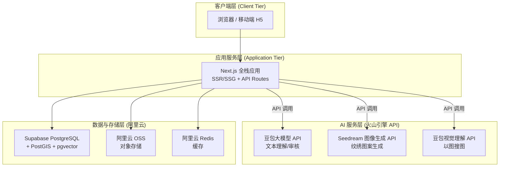

### 1.2 架构决策的核心原则

| 原则 | 说明 |
|------|------|
| **SSR 优先** | 文化内容需要 SEO，首屏需要极快加载，选择 Next.js SSR/SSG |
| **AI 解耦** | AI 能力通过火山引擎 API 调用，不占用主服务器资源 |
| **渐进增强** | 3D 特效作为增强体验，基础内容在无 WebGL 环境下仍可访问 |
| **数据库优先** | 所有纹案数据结构化入库，不使用硬编码或 JSON 文件 |
| **开放接口** | 从第一天起以 RESTful API 为核心，未来直接暴露为开放 API |

---

## 2. 前端架构深度分析

### 2.1 框架选型：Next.js vs Nuxt.js vs Vite SPA

| 维度 | Next.js (React) | Nuxt.js (Vue) | Vite SPA (React) |
|------|:---:|:---:|:---:|
| SSR/SSG 支持 | ✅ 原生支持 | ✅ 原生支持 | ❌ 纯客户端 |
| SEO 友好度 | ⭐⭐⭐⭐⭐ | ⭐⭐⭐⭐⭐ | ⭐⭐ |
| Three.js 生态 | ⭐⭐⭐⭐⭐ (R3F) | ⭐⭐⭐ (TresJS) | ⭐⭐⭐⭐⭐ |
| 地图库集成 | ⭐⭐⭐⭐⭐ | ⭐⭐⭐⭐ | ⭐⭐⭐⭐⭐ |
| API Routes | ✅ 内置 | ✅ 内置 | ❌ 需额外后端 |
| 社区 & 生态 | 最大 | 较大 | 中等 |
| 中国区部署 | ✅ 自建部署方便 | ✅ | ✅ |

> [!IMPORTANT]
> **决策：选择 Next.js 16.2 (App Router)**
> - 选型理由 1：SSR/SSG 对文化内容 SEO 至关重要（百度/Google 收录）
> - 选型理由 2：React Three Fiber (R3F) 是目前最成熟的 React 3D 渲染方案
> - 选型理由 3：API Routes 可以处理轻量 BFF（Backend For Frontend）逻辑，减少独立后端工作量
> - 选型理由 4：App Router 的并行路由、拦截路由很适合做"点击纹绣→弹出详情 Modal"的交互模式
> - **安全声明：Next.js 15 及以下版本已知存在路由绕过与缓存污染高危 CVE 漏洞，严禁使用**

### 2.2 前端目录结构规范

```
src/
├── app/                          # Next.js App Router
│   ├── (public)/                 # 公开访问的路由组
│   │   ├── page.tsx              # 首页（Hero + 每日精选 + 热门榜）
│   │   ├── gallery/              # 纹案画廊
│   │   │   ├── page.tsx          # 画廊列表（瀑布流/网格 + 多维筛选面板）
│   │   │   └── [id]/             # 单个纹案详情页
│   │   │       ├── page.tsx
│   │   │       └── @modal/       # 拦截路由弹窗
│   │   ├── map/                  # 3D 地图探索页
│   │   │   └── page.tsx
│   │   ├── timeline/             # 纹案演化时间线
│   │   │   └── page.tsx
│   │   ├── search/               # 高级搜索（以图搜图/颜色搜索/多维筛选）
│   │   │   └── page.tsx
│   │   ├── create/               # AI 辅助创作页
│   │   │   ├── generate/         # AI 图案生成
│   │   │   └── merchandise/      # 3D 文创预览
│   │   ├── community/            # 社区互动
│   │   │   ├── page.tsx          # 社区首页
│   │   │   └── [postId]/         # 帖子详情
│   │   ├── profile/              # 用户个人主页
│   │   │   ├── page.tsx          # 我的主页（上传/收藏/徽章/统计）
│   │   │   ├── collections/      # 我的收藏夹
│   │   │   └── notifications/    # 通知中心
│   │   ├── about/                # 关于页面
│   │   ├── disclaimer/           # 免责声明
│   │   └── privacy/              # 隐私政策 (PIPL 合规)
│   ├── (admin)/                  # 后台管理路由组（需鉴权）
│   │   └── dashboard/
│   │       ├── page.tsx          # 数据概览（流量/内容/用户/AI/社区多维统计）
│   │       ├── moderation/       # 内容审核管理
│   │       ├── reports/          # 举报处理队列
│   │       ├── users/            # 用户管理
│   │       ├── patterns/         # 纹案管理
│   │       ├── api-keys/         # 开放 API Key 管理
│   │       └── ich/              # 非遗关联管理
│   ├── api/                      # API Routes (BFF)
│   │   ├── patterns/             # 纹案 CRUD
│   │   ├── comments/             # 评论
│   │   ├── collections/          # 收藏夹 CRUD
│   │   ├── notifications/        # 通知
│   │   ├── reports/              # 举报
│   │   ├── search/               # 高级搜索（全文/向量/颜色）
│   │   ├── auth/                 # 认证
│   │   ├── ai/                   # AI 代理层 (调用火山引擎 API)
│   │   └── v1/                   # 开放 API (对外暴露)
│   ├── layout.tsx                # 根布局
│   └── globals.css               # 全局样式
├── components/
│   ├── ui/                       # 基础 UI 组件
│   │   ├── Button.tsx
│   │   ├── Card.tsx
│   │   ├── Modal.tsx
│   │   ├── Badge.tsx             # 徽章/标记组件
│   │   ├── NotificationBell.tsx  # 通知铃铛
│   │   ├── ReportDialog.tsx      # 举报弹窗
│   │   └── ...
│   ├── pattern/                  # 纹案相关组件
│   │   ├── PatternCard.tsx       # 纹案卡片（含版权标识 + AI标记）
│   │   ├── PatternDetail.tsx     # 纹案详情
│   │   ├── PatternGrid.tsx       # 纹案网格布局
│   │   ├── PatternTimeline.tsx   # 演化时间线
│   │   ├── RelationGraph.tsx     # 知识图谱关系图
│   │   ├── ColorPalette.tsx      # 颜色色板展示
│   │   └── LicenseBadge.tsx      # 版权协议徽章
│   ├── search/                   # 搜索相关组件
│   │   ├── FilterPanel.tsx       # 多维筛选面板
│   │   ├── ImageSearch.tsx       # 以图搜图上传组件
│   │   └── ColorPicker.tsx       # 颜色搜索拾色器
│   ├── map/                      # 地图相关组件
│   │   ├── MapCanvas.tsx         # 地图主画布
│   │   ├── MapMarker.tsx         # 地图标记点
│   │   └── GlowEffect.tsx       # 3D 光晕效果
│   ├── three/                    # 3D 渲染组件
│   │   ├── MerchandiseViewer.tsx # 文创 3D 预览器
│   │   ├── TextureMapper.tsx     # 纹理映射器
│   │   └── Scene.tsx             # Three.js 场景管理
│   └── layout/                   # 布局组件
│       ├── Header.tsx
│       ├── Footer.tsx
│       └── Sidebar.tsx
├── lib/                          # 工具库
│   ├── db/                       # 数据库客户端 (Prisma/pg)
│   │   ├── client.ts             # Prisma Client 封装
│   │   └── queries.ts            # 常用查询函数
│   ├── oss/                      # 阿里云 OSS 客户端
│   │   └── client.ts             # 签名 URL 生成 / 上传
│   ├── api/                      # API 调用封装
│   ├── watermark/                # 水印工具（可见 + 隐形数字水印）
│   ├── utils/                    # 通用工具函数
│   └── constants.ts              # 全局常量
├── hooks/                        # 自定义 React Hooks
│   ├── usePattern.ts
│   ├── useMap.ts
│   ├── useAuth.ts
│   ├── useCollection.ts
│   └── useNotifications.ts
├── stores/                       # 状态管理 (Zustand)
│   ├── usePatternStore.ts
│   ├── useMapStore.ts
│   ├── useAuthStore.ts
│   └── useNotificationStore.ts
├── types/                        # TypeScript 类型定义
│   ├── pattern.ts
│   ├── user.ts
│   ├── collection.ts
│   └── api.ts
└── styles/                       # 样式相关
    ├── design-tokens.css         # CSS 变量 / 设计令牌
    └── animations.css            # 动画定义
```

### 2.3 样式方案选型

| 方案 | 优势 | 劣势 | 适用性 |
|------|------|------|--------|
| Tailwind CSS v4.2.2 | 开发速度极快，JIT 编译零冗余；CSS-first 配置，无需 `tailwind.config.js` | 类名冗长，3D 场景内不适用 | ✅ 推荐用于页面布局 |
| CSS Modules | 零冲突，原生支持 | 编写略繁琐 | ✅ 用于复杂组件 |
| Motion v12 (原 Framer Motion) | 声明式动画，与 React 深度集成；已改名，使用 `motion/react` 导入 | 包体积较大 | ✅ 用于页面过渡和微动效 |
| GSAP | 最强大的动画库，时间轴控制 | 商业授权费用 | ⚠️ 备选，仅在需要极复杂动画时 |

> [!TIP]
> **推荐组合：Tailwind CSS v4.2.2 (页面) + CSS Modules（复杂组件） + Motion v12（动画）**
> 3D 场景内（Three.js / Mapbox）自有渲染管线，不使用 CSS 动画。

### 2.4 状态管理

- **全局状态**：使用 **Zustand 5**（极轻量，仅 ~1KB，TypeScript 友好）
- **服务端数据缓存**：使用 **TanStack Query v5**（自动缓存、失效、重新请求）
- **避免方案**：Redux（过于笨重）、Context API（大规模状态时渲染性能差）

```typescript
// 示例：纹案 Store
interface PatternStore {
  selectedPattern: Pattern | null;
  filterRegion: string | null;
  filterEra: string | null;
  setSelectedPattern: (pattern: Pattern | null) => void;
  setFilter: (region?: string, era?: string) => void;
}
```

---

## 3. 后端架构深度分析

### 3.1 单服务架构（Next.js API Routes + 火山引擎 API）

项目后端采用 **单服务架构**，所有业务逻辑通过 Next.js API Routes 处理，AI 能力通过火山引擎 API 调用：

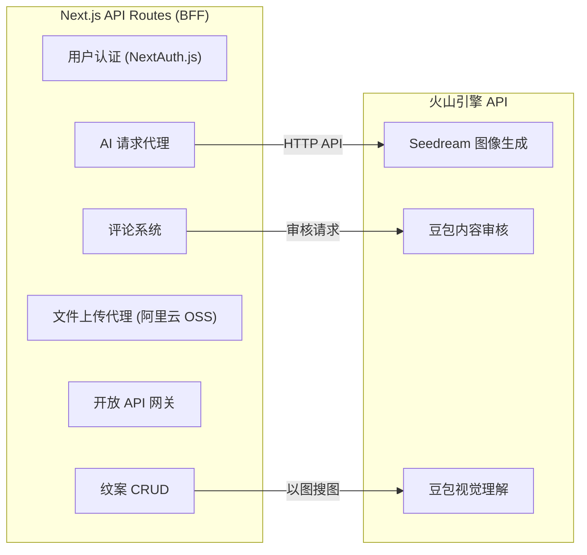

### 3.2 架构简化说明

| 对比点 | 旧方案（Supabase + FastAPI） | 新方案（阿里云 + 火山引擎 API） |
|--------|---------|-------------------|
| 数据库访问 | Supabase SDK（海外 100-200ms） | Prisma + RDS（内网 <1ms） |
| AI 推理 | 自建 FastAPI + GPU 服务器 | 火山引擎 API 按次调用 |
| 异步任务 | Celery + Redis Queue | 前端轮询 + 数据库状态记录 |
| 文件存储 | Supabase Storage | 阿里云 OSS + 签名 URL |
| 用户认证 | Supabase Auth | NextAuth.js |
| 实时通知 | Supabase Realtime | 轮询（初期）/ Socket.io（未来） |
| 定时拉取 | Next.js API 定时任务 + Redis | 将数据源内容同步到本地数据库 |

> [!IMPORTANT]
> **架构简化核心决策**：
> - 无需独立 Python 后端：AI 调用直接透过 Next.js API Routes 发送 HTTP 请求到火山引擎
> - 无需 GPU 服务器：所有 AI 能力按次付费，零固定成本
> - 全部服务同地域内网通信，延迟极低

### 3.3 AI 请求代理示例

```typescript
// app/api/ai/generate/route.ts
import { NextRequest, NextResponse } from 'next/server'

export async function POST(req: NextRequest) {
  const { prompt, style } = await req.json()
  
  // 调用火山引擎 Seedream API
  const response = await fetch('https://visual.volcengineapi.com/v1/images/generations', {
    method: 'POST',
    headers: {
      'Content-Type': 'application/json',
      'Authorization': `Bearer ${process.env.VOLCENGINE_API_KEY}`
    },
    body: JSON.stringify({
      model: 'doubao-seedream-5.0-lite',
      prompt: `湖北传统纹绣图案, ${style}风格, ${prompt}, 高清, 传统文化`,
      size: '1024x1024',
      n: 1
    })
  })
  
  const data = await response.json()
  // 存入阿里云 OSS 并记录到 ai_tasks 表
  return NextResponse.json({ imageUrl: data.data[0].url })
}
```

### 3.4 异步任务处理（前端轮询模式）

AI 图像生成耗时较长（5~30 秒），采用前端轮询模式：


技术选型：
- **状态存储**：Supabase PostgreSQL ai_tasks 表
- **文件存储**：阿里云 OSS（服务端签名上传）
- **实时状态推送**：前端轮询（初期），后续可升级为 Socket.io

---

## 4. 数据库设计

### 4.1 技术选型：PostgreSQL + PostGIS

> [!NOTE]
> 选择 PostgreSQL 而非 MySQL 的核心理由：
> 1. **PostGIS 插件**：纹案需要按地理位置存储和查询，PostGIS 是行业标准
> 2. **JSONB 类型**：纹案的元数据（颜色特征、纹理参数）可以灵活存储为 JSONB
> 3. **全文搜索**：内置 `tsvector` 支持中文全文搜索（配合 zhparser 扩展）
> 4. **Supabase 原生支持**：同地域内网 <1ms 延迟，无需海外绕行

### 4.2 核心数据模型 (ER 图)

> [!NOTE]
> v2.0 扩展：从原始 8 张表扩展至 **18 张表**，新增知识图谱、收藏、通知、举报、非遗、版权等数据结构。

```mermaid
erDiagram
    USERS ||--o{ PATTERNS : "上传"
    USERS ||--o{ COMMENTS : "发表"
    USERS ||--o{ USER_LIKES : "点赞"
    USERS ||--o{ COLLECTIONS : "创建收藏夹"
    USERS ||--o{ NOTIFICATIONS : "接收通知"
    USERS ||--o{ USER_VIEW_HISTORY : "浏览记录"
    USERS ||--o{ REPORTS : "提交举报"
    USERS ||--o{ USER_BADGES : "获得徽章"
    PATTERNS ||--o{ PATTERN_MEDIA : "包含媒体"
    PATTERNS ||--o{ COMMENTS : "拥有评论"
    PATTERNS ||--o{ USER_LIKES : "被点赞"
    PATTERNS ||--o{ PATTERN_TAGS : "拥有标签"
    PATTERNS ||--o{ PATTERN_RELATIONS : "关联关系"
    PATTERNS ||--o{ COLLECTION_ITEMS : "被收藏"
    TAGS ||--o{ PATTERN_TAGS : "关联纹案"
    REGIONS ||--o{ PATTERNS : "所属地区"
    AI_TASKS ||--o{ PATTERNS : "生成纹案"
    TECHNIQUES ||--o{ PATTERNS : "使用技法"
    ICH_RECORDS ||--o{ PATTERNS : "关联非遗"
    COLLECTIONS ||--o{ COLLECTION_ITEMS : "包含条目"

    USERS {
        uuid id PK
        string email UK
        string nickname
        string avatar_url
        enum role "admin/moderator/user"
        int contribution_points "贡献积分"
        enum contributor_level "newcomer/contributor/expert/inheritor"
        jsonb preferences "个性化偏好设置"
        boolean agreed_privacy_policy "已同意隐私政策"
        timestamp created_at
        timestamp last_login
    }

    PATTERNS {
        uuid id PK
        string name "纹案名称"
        text description "详细描述(Markdown)"
        text historical_background "历史背景(Markdown)"
        string era "所属时期"
        geometry location "PostGIS 地理坐标"
        uuid region_id FK
        uuid uploader_id FK
        uuid technique_id FK "关联技法"
        uuid ich_record_id FK "关联非遗项目"
        boolean is_ai_generated "是否 AI 生成"
        string ai_model_version "AI 模型版本"
        enum status "pending/approved/rejected/featured"
        enum license_type "public_domain/cc-by/cc-by-nc-sa/copyright"
        string source_declaration "来源声明"
        string copyright_holder "版权持有者"
        vector embedding "CLIP 图像向量(512维)"
        jsonb color_palette "自动提取的主色调"
        jsonb metadata "扩展元数据"
        int view_count
        int like_count
        int comment_count
        timestamp created_at
        timestamp updated_at
    }

    PATTERN_MEDIA {
        uuid id PK
        uuid pattern_id FK
        enum media_type "image/video/3d_model/deep_zoom"
        string url "存储 URL"
        string thumbnail_url "缩略图"
        string watermarked_url "水印版 URL"
        int sort_order
        jsonb metadata "宽高/时长/格式/物理尺寸/材质"
    }

    PATTERN_RELATIONS {
        uuid id PK
        uuid source_pattern_id FK
        uuid target_pattern_id FK
        enum relation_type "evolved_from/influenced_by/variant_of/same_origin"
        text description
        float confidence "关系可信度"
        uuid created_by FK
    }

    TECHNIQUES {
        uuid id PK
        string name "技法名称(如挑花/织锦/蜡染)"
        enum category "embroidery/dyeing/weaving/printing"
        text description
        uuid origin_region_id FK
        int difficulty_level "1-5难度"
    }

    ICH_RECORDS {
        uuid id PK
        string name "非遗项目名称"
        string official_code "官方编号"
        enum level "national/provincial/municipal"
        enum protection_status "endangered/general/good"
        text inheritor_info "传承人信息(经授权)"
        text description
    }

    REGIONS {
        uuid id PK
        string name "地区名称"
        string province
        string city
        geometry boundary "PostGIS 行政区边界"
        text cultural_intro
    }

    COMMENTS {
        uuid id PK
        uuid pattern_id FK
        uuid user_id FK
        uuid parent_id FK "支持回复嵌套"
        text content
        enum status "pending/approved/rejected"
        string moderation_reason
        timestamp created_at
    }

    TAGS {
        uuid id PK
        string name UK
        string category "朝代/技法/颜色/风格"
    }

    PATTERN_TAGS {
        uuid pattern_id FK
        uuid tag_id FK
    }

    USER_LIKES {
        uuid user_id FK
        uuid pattern_id FK
        timestamp created_at
    }

    COLLECTIONS {
        uuid id PK
        uuid user_id FK
        string name
        text description
        boolean is_public "是否公开分享"
        timestamp created_at
    }

    COLLECTION_ITEMS {
        uuid collection_id FK
        uuid pattern_id FK
        text note "用户个人备注"
        timestamp added_at
    }

    USER_VIEW_HISTORY {
        uuid user_id FK
        uuid pattern_id FK
        timestamp viewed_at
        int view_duration_seconds "停留时长"
    }

    NOTIFICATIONS {
        uuid id PK
        uuid user_id FK
        enum type "comment_reply/moderation_result/system/badge_earned"
        string title
        text content
        string related_url
        boolean is_read
        timestamp created_at
    }

    REPORTS {
        uuid id PK
        uuid reporter_id FK
        enum target_type "pattern/comment/user"
        uuid target_id
        enum reason "misinformation/copyright/low_quality/offensive/other"
        text description
        enum status "pending/resolved/dismissed"
        uuid resolved_by FK
        timestamp created_at
    }

    USER_BADGES {
        uuid user_id FK
        string badge_key "first_upload/hundred_likes/expert等"
        timestamp earned_at
    }

    AI_TASKS {
        uuid id PK
        uuid user_id FK
        enum task_type "generate/texture_map/moderate/embed_image"
        string prompt
        jsonb parameters
        enum status "queued/processing/completed/failed"
        string result_url
        int processing_time_ms
        timestamp created_at
        timestamp completed_at
    }

    API_KEYS {
        uuid id PK
        uuid user_id FK
        string key_hash UK
        enum tier "free/basic/premium"
        enum purpose "academic/personal/commercial"
        int rate_limit_per_hour
        boolean is_active
        timestamp created_at
        timestamp last_used_at
    }
```

### 4.3 关键索引设计

```sql
-- ==================== 空间索引 ====================
CREATE INDEX idx_patterns_location ON patterns USING GIST (location);
CREATE INDEX idx_regions_boundary ON regions USING GIST (boundary);

-- ==================== 状态与排序索引 ====================
CREATE INDEX idx_patterns_status_created ON patterns (status, created_at DESC);
CREATE INDEX idx_patterns_featured ON patterns (status) WHERE status = 'featured';

-- ==================== 全文搜索索引 ====================
CREATE INDEX idx_patterns_search ON patterns 
  USING GIN (to_tsvector('zhcfg', name || ' ' || description));

-- ==================== 向量相似度索引 (以图搜图) ====================
CREATE EXTENSION IF NOT EXISTS vector;
CREATE INDEX idx_patterns_embedding ON patterns 
  USING ivfflat (embedding vector_cosine_ops) WITH (lists = 100);

-- ==================== 关系与标签索引 ====================
CREATE INDEX idx_comments_pattern ON comments (pattern_id, status, created_at DESC);
CREATE INDEX idx_pattern_tags_pattern ON pattern_tags (pattern_id);
CREATE INDEX idx_pattern_tags_tag ON pattern_tags (tag_id);
CREATE INDEX idx_pattern_relations_source ON pattern_relations (source_pattern_id);
CREATE INDEX idx_pattern_relations_target ON pattern_relations (target_pattern_id);

-- ==================== 收藏与浏览索引 ====================
CREATE INDEX idx_collections_user ON collections (user_id);
CREATE INDEX idx_collection_items_coll ON collection_items (collection_id);
CREATE INDEX idx_view_history_user ON user_view_history (user_id, viewed_at DESC);

-- ==================== 通知与举报索引 ====================
CREATE INDEX idx_notifications_user_unread ON notifications (user_id, is_read) 
  WHERE is_read = false;
CREATE INDEX idx_reports_status ON reports (status) WHERE status = 'pending';

-- ==================== API Key 索引 ====================
CREATE INDEX idx_api_keys_hash ON api_keys (key_hash) WHERE is_active = true;
```

### 4.4 PostgreSQL RLS (行级安全) 策略

```sql
-- ==================== 纹案 RLS ====================
ALTER TABLE patterns ENABLE ROW LEVEL SECURITY;

CREATE POLICY "公开读取已审核纹案" ON patterns
  FOR SELECT USING (status IN ('approved', 'featured'));

CREATE POLICY "用户创建纹案" ON patterns
  FOR INSERT WITH CHECK (current_setting('app.current_user_id')::uuid = uploader_id);

CREATE POLICY "用户编辑自己的纹案" ON patterns
  FOR UPDATE USING (current_setting('app.current_user_id')::uuid = uploader_id OR 
    EXISTS (SELECT 1 FROM users WHERE id = current_setting('app.current_user_id')::uuid AND role IN ('admin', 'moderator')));

-- ==================== 评论 RLS ====================
ALTER TABLE comments ENABLE ROW LEVEL SECURITY;

CREATE POLICY "公开读取已审核评论" ON comments
  FOR SELECT USING (status = 'approved');

CREATE POLICY "登录用户发表评论" ON comments
  FOR INSERT WITH CHECK (current_setting('app.current_user_id')::uuid = user_id);

-- ==================== 收藏夹 RLS ====================
ALTER TABLE collections ENABLE ROW LEVEL SECURITY;

CREATE POLICY "用户管理自己的收藏夹" ON collections
  FOR ALL USING (current_setting('app.current_user_id')::uuid = user_id);

CREATE POLICY "公开收藏夹可读" ON collections
  FOR SELECT USING (is_public = true);

-- ==================== 通知 RLS ====================
ALTER TABLE notifications ENABLE ROW LEVEL SECURITY;

CREATE POLICY "用户只能读取自己的通知" ON notifications
  FOR SELECT USING (current_setting('app.current_user_id')::uuid = user_id);

CREATE POLICY "用户标记自己的通知为已读" ON notifications
  FOR UPDATE USING (current_setting('app.current_user_id')::uuid = user_id);

-- ==================== 举报 RLS ====================
ALTER TABLE reports ENABLE ROW LEVEL SECURITY;

CREATE POLICY "登录用户可以提交举报" ON reports
  FOR INSERT WITH CHECK (current_setting('app.current_user_id')::uuid = reporter_id);

CREATE POLICY "仅管理员可查看和处理举报" ON reports
  FOR SELECT USING (
    EXISTS (SELECT 1 FROM users WHERE id = current_setting('app.current_user_id')::uuid AND role IN ('admin', 'moderator'))
  );
```

---

## 5. AI 子系统架构

### 5.1 AI 功能矩阵

| 功能 | 技术方案 | 部署位置 | 延迟要求 |
|------|----------|----------|----------|
| 纹绣图案生成 | 豆包 Seedream 5.0 API | 火山引擎 API | 5~30s（异步） |
| 2D→3D 纹理映射 | Three.js UV Mapping (前端) | 浏览器 | <100ms 实时 |
| 文本内容审核 | 豆包大模型 2.0 / 1.6 Lite | 火山引擎 API | <2s |
| 图片内容审核 | 豆包视觉理解模型 | 火山引擎 API | <3s |
| AI 标注识别 | 数据库字段标记 | 无需模型 | - |
| **图像向量嵌入** | **豆包视觉理解模型** | **火山引擎 API** | **<1s** |
| **色彩提取** | **Canvas k-means 聚类** | **前端/Next.js API** | **<500ms** |
| **图片水印** | **可见水印 + 隐形数字水印** | **Next.js API** | **<1s** |
| **个性化推荐** | **基于标签协同过滤** | **Next.js API** | **<200ms** |

### 5.2 图案生成模型训练路径

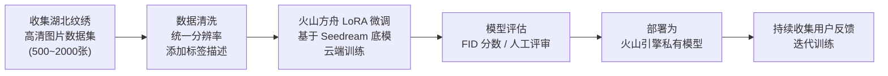
```

### 5.3 LoRA 训练关键参数建议

```yaml
base_model: doubao-seedream-5.0-lite  # 火山引擎 Seedream 底模
training:
  platform: 火山方舟 (Ark)    # 云端训练，无需本地 GPU
  method: LoRA
  rank: 32              # 平衡质量和训练速度
  alpha: 16
  learning_rate: 1e-4
  epochs: 50~100
  resolution: 1024x1024
  trigger_word: "hubei_pattern"  # 触发词

dataset:
  min_images: 500        # 至少 500 张高质量样本
  format: PNG/JPEG
  captions: true         # 每张图配文字描述
  augmentation:          # 数据增强
    - horizontal_flip
    - rotation_15deg
    - color_jitter

deployment:
  target: 火山引擎私有模型  # 训练完成后部署为 API 服务
  cost: 按训练时长计费     # 无需购买 GPU 服务器
```

### 5.4 内容审核流程

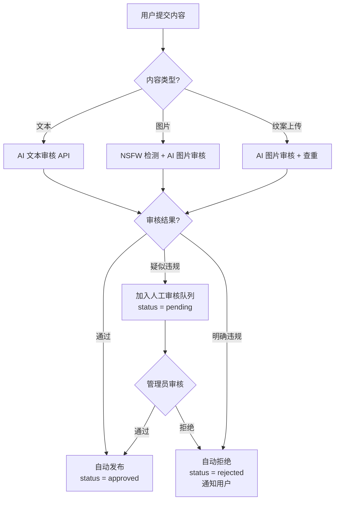

---

## 6. 3D 渲染子系统

### 6.1 技术选型：Three.js + React Three Fiber

| 方案 | 优势 | 劣势 |
|------|------|------|
| **Three.js + R3F** ✅ | React 声明式 3D，生态最大 | 学习曲线中等 |
| Babylon.js | 功能完整的游戏引擎级 | 包体过大，杀鸡用牛刀 |
| PlayCanvas | 编辑器友好 | 社区小，自定义难度高 |

### 6.2 3D 文创预览实现路径

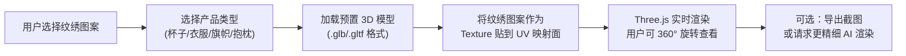

### 6.3 3D 模型资源管理

```
public/
└── models/
    ├── cup.glb           # 杯子模型 (~500KB)
    ├── tshirt.glb        # T恤模型 (~800KB)
    ├── pillow.glb        # 抱枕模型 (~400KB)
    ├── flag.glb          # 旗帜模型 (~300KB)
    └── blanket.glb       # 被子/毯子模型 (~600KB)
```

> [!NOTE]
> 所有 3D 模型需要提前在 Blender 中完成 UV 展开，确保 UV 映射区域与纹绣贴图对齐。
> 模型面数控制在 5000~20000 以内，确保移动端流畅渲染。

### 6.4 前端 3D 渲染核心代码架构

```tsx
// components/three/MerchandiseViewer.tsx
import { Canvas } from '@react-three/fiber'
import { OrbitControls, useGLTF, useTexture } from '@react-three/drei'

interface Props {
  modelPath: string      // 3D 模型路径
  patternImageUrl: string // 纹绣贴图 URL
}

function ProductModel({ modelPath, patternImageUrl }: Props) {
  const { scene } = useGLTF(modelPath)
  const texture = useTexture(patternImageUrl)
  
  // 遍历模型 Mesh，替换贴图
  scene.traverse((child) => {
    if (child.isMesh && child.material) {
      child.material.map = texture
      child.material.needsUpdate = true
    }
  })
  
  return <primitive object={scene} />
}

export default function MerchandiseViewer(props: Props) {
  return (
    <Canvas camera={{ position: [0, 0, 3], fov: 50 }}>
      <ambientLight intensity={0.5} />
      <spotLight position={[10, 10, 10]} angle={0.15} />
      <ProductModel {...props} />
      <OrbitControls enableZoom enablePan={false} />
    </Canvas>
  )
}
```

---

## 7. 地图子系统

### 7.1 技术选型深度对比

| 方案 | 自定义底图 | 3D 效果 | 中国合规 | 离线可用 | 免费额度 |
|------|:---:|:---:|:---:|:---:|:---:|
| **Mapbox GL JS** | ⭐⭐⭐⭐⭐ | ⭐⭐⭐⭐⭐ | ⚠️ 需注意 | ❌ | 50K次/月 |
| 高德地图 JS API | ⭐⭐⭐ | ⭐⭐⭐ | ✅ 原生合规 | ❌ | 30万次/日 |
| Leaflet + 插件 | ⭐⭐⭐ | ⭐⭐ | ✅ | ✅ | 完全免费 |
| Cesium.js | ⭐⭐⭐⭐ | ⭐⭐⭐⭐⭐ | ⚠️ | ✅ | 开源 |
| **Deck.gl + Mapbox** | ⭐⭐⭐⭐⭐ | ⭐⭐⭐⭐⭐ | ⚠️ 需注意 | ❌ | 取决底图 |

> [!WARNING]
> **中国地图合规性注意事项**：
> - 使用国外地图服务（Mapbox/Google Maps）时，必须确保中国边境线和南海九段线的正确显示
> - **推荐方案**：使用 **高德地图 JS API** 作为底图确保合规，配合 **Deck.gl** 做 3D 数据可视化叠加层
> - 备选方案：自建底图瓦片 + Mapbox GL JS 渲染引擎（使用天地图数据源）

### 7.2 推荐地图架构

```
高德地图 (AMap JS API v2.0) — 提供合规底图
        +
Deck.gl Overlay — 提供 3D 光晕效果和数据可视化层
        +
自定义 GeoJSON — 湖北省市县边界数据
```

### 7.3 3D 光晕效果核心实现思路

当用户点击某个纹绣位置时，触发以下视觉效果：

```typescript
// 基于 Deck.gl 的 3D 光晕效果
import { ScatterplotLayer } from '@deck.gl/layers'

const glowLayer = new ScatterplotLayer({
  id: 'glow-effect',
  data: [selectedPattern],
  getPosition: d => [d.longitude, d.latitude],
  getRadius: d => d.isSelected ? 50000 : 5000,  // 选中时放大
  getFillColor: d => d.isSelected 
    ? [255, 215, 0, 180]   // 金色光晕
    : [200, 50, 50, 150],  // 常态暗红
  radiusScale: 1,
  radiusMinPixels: 3,
  radiusMaxPixels: 100,
  transitions: {
    getRadius: { duration: 800, easing: easeOutCubic },
    getFillColor: { duration: 600 }
  }
})
```

### 7.4 地图交互流程

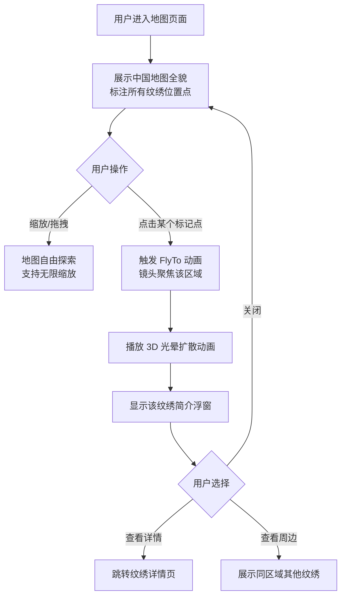

---

## 8. 文件存储与 CDN

### 8.1 存储策略

| 资源类型 | 存储位置 | 访问方式 | 说明 |
|----------|----------|----------|------|
| 纹绣高清原图 | 阿里云 OSS | CDN 分发 | 原始分辨率，支持下载 |
| 缩略图 | 阿里云 OSS（自动生成） | CDN + 缓存 | 页面列表使用 |
| 视频文件 | 阿里云 OSS + 视频点播 | CDN 分发 | 支持转码和自适应码率 |
| 3D 模型 (.glb) | 静态资源 / CDN | CDN 缓存 | 预置模型，数量有限 |
| AI 生成图片 | 阿里云 OSS | CDN 分发 | 有时效性，可设过期清理 |
| 用户头像 | 阿里云 OSS | CDN 缓存 | 限制尺寸 |

### 8.2 图片处理管线

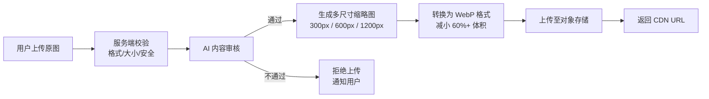

---

## 9. 认证与权限体系

### 9.1 认证方案

使用 **NextAuth.js**：

- 支持邮箱/密码注册登录
- 支持 OAuth 第三方登录（微信、GitHub 等）
- JWT Token 自动管理
- 服务端 Session 验证
- 用户数据存储在 Supabase PostgreSQL

### 9.2 角色权限矩阵

| 功能 | 游客 | 普通用户 | 内容审核员 | 管理员 |
|------|:---:|:---:|:---:|:---:|
| 浏览纹案详情 | ✅ | ✅ | ✅ | ✅ |
| 使用 3D 地图 | ✅ | ✅ | ✅ | ✅ |
| 高级搜索/筛选 | ✅ | ✅ | ✅ | ✅ |
| 发表评论 | ❌ | ✅ | ✅ | ✅ |
| 上传纹绣 | ❌ | ✅ | ✅ | ✅ |
| 收藏/创建画板 | ❌ | ✅ | ✅ | ✅ |
| 以图搜图 | ❌ | ✅ | ✅ | ✅ |
| 使用 AI 生成 | ❌ | ✅ (限频) | ✅ | ✅ |
| 举报内容 | ❌ | ✅ | ✅ | ✅ |
| 审核内容 | ❌ | ❌ | ✅ | ✅ |
| 处理举报 | ❌ | ❌ | ✅ | ✅ |
| 管理用户 | ❌ | ❌ | ❌ | ✅ |
| 管理系统设置 | ❌ | ❌ | ❌ | ✅ |
| 管理非遗关联 | ❌ | ❌ | ❌ | ✅ |
| 管理 API Key | ❌ | ❌ | ❌ | ✅ |
| 使用开放 API | ❌ | ✅ (需申请 Key) | ✅ | ✅ |

---

## 10. API 设计规范

### 10.1 内部 API (BFF)

供前端直接调用，走 Next.js API Routes：

# 纹案
GET    /api/patterns              # 列表（分页、筛选、排序）
GET    /api/patterns/:id          # 详情
POST   /api/patterns              # 创建（需登录）
PUT    /api/patterns/:id          # 更新（需权限）
DELETE /api/patterns/:id          # 删除（需权限）
GET    /api/patterns/:id/relations # 获取纹案关联关系图谱

# 高级搜索
GET    /api/search?q=&era=&region=&technique=&color=  # 多维筛选
POST   /api/search/image          # 以图搜图（上传图片返回相似纹案）
GET    /api/search/color?hex=     # 按颜色搜索

# 评论
GET    /api/patterns/:id/comments # 获取评论列表
POST   /api/patterns/:id/comments # 发表评论（需登录 + AI 审核）

# 收藏夹
GET    /api/collections           # 我的收藏夹列表
POST   /api/collections           # 创建收藏夹
PUT    /api/collections/:id       # 更新收藏夹
DELETE /api/collections/:id       # 删除收藏夹
POST   /api/collections/:id/items # 添加纹案到收藏夹
DELETE /api/collections/:id/items/:patternId # 移除

# 通知
GET    /api/notifications         # 获取通知列表
PUT    /api/notifications/:id/read # 标记已读
PUT    /api/notifications/read-all # 全部已读

# 举报
POST   /api/reports               # 提交举报

# 地图数据
GET    /api/map/markers           # 获取所有纹绣标记点
GET    /api/map/regions           # 获取区域边界 GeoJSON
GET    /api/map/region/:id        # 获取区域详情
GET    /api/map/heatmap           # 热力图数据

# AI 功能
POST   /api/ai/generate           # 提交生成任务
GET    /api/ai/tasks/:taskId      # 查询任务状态
POST   /api/ai/embed-image        # 图像向量化（以图搜图）
POST   /api/ai/moderate           # 内容审核（内部调用）

# 用户
GET    /api/users/me              # 当前用户信息（含徽章/等级/积分）
PUT    /api/users/me              # 更新资料
GET    /api/users/me/history      # 浏览历史
GET    /api/users/:id/profile     # 他人公开主页
DELETE /api/users/me/data         # 删除个人数据 (PIPL 合规)
GET    /api/users/me/export       # 导出个人数据 (PIPL 合规)

# 管理后台
GET    /api/admin/stats           # 统计数据（流量/内容/用户/AI/社区多维）
GET    /api/admin/pending         # 待审核列表
PUT    /api/admin/moderate/:id    # 审核操作
GET    /api/admin/reports         # 举报队列
PUT    /api/admin/reports/:id     # 处理举报
GET    /api/admin/api-keys        # API Key 管理
```

### 10.2 开放 API (Public API v1)

```
# 开放 API — 供第三方调用
# 所有请求需携带 API Key: Authorization: Bearer <api_key>

GET /api/v1/patterns                    # 查询纹案列表
GET /api/v1/patterns/:id                # 获取纹案详情
GET /api/v1/patterns/search?q=楚文化     # 搜索
GET /api/v1/regions                     # 获取地区列表
GET /api/v1/regions/:id/patterns        # 获取某地区的纹案
GET /api/v1/tags                        # 获取标签分类

# 速率限制:
# - 免费 Tier: 100 次/小时
# - 基础 Tier: 1000 次/小时
# - 高级 Tier: 10000 次/小时
```

### 10.3 API 响应标准格式

```json
{
  "success": true,
  "data": { ... },
  "pagination": {
    "page": 1,
    "pageSize": 20,
    "total": 156,
    "totalPages": 8
  },
  "meta": {
    "requestId": "req_xxx",
    "timestamp": "2026-03-11T17:00:00Z"
  }
}
```

---

## 11. 部署架构

### 11.1 基本信息

| 项目 | 说明 |
|------|------|
| **服务器** | 已有阿里云 ECS（运行 Next.js + Nginx） |
| **域名（暂定）** | `HBpattern.husteread.com` |
| **数据库** | Supabase PostgreSQL（同地域内网 <1ms） |
| **对象存储** | 阿里云 OSS |
| **缓存** | 阿里云 Redis |
| **认证** | NextAuth.js |
| **AI 服务** | 火山引擎/豆包 API 调用（无 GPU 服务器，按次计费） |

> [!NOTE]
> **全部服务选择同一地域**（如华东1杭州），ECS、RDS、OSS、Redis 之间走内网，延迟极低且无流量费。

### 11.2 部署拓扑

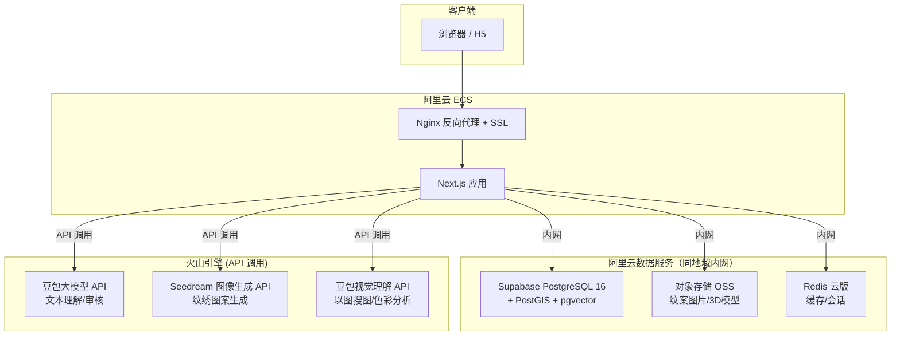

### 11.3 服务器成本估算（按量付费）

| 服务 | 规格 | 预估月成本 | 说明 |
|------|------|:---:|------|
| Supabase PostgreSQL | 基础版 2核4G, 20GB ESSD | ~30-50元 | 按量付费，闲置时仅收存储 |
| 阿里云 OSS | 标准存储 LRS | ~0-5元 | 0.12元/GB/月 |
| 阿里云 Redis | 256MB 云原生 | ~6-10元 | 按量付费 |
| AI API (火山引擎) | 按次调用 | ~66-341元 | 见第 20 章详细估算 |
| **基础设施合计** | | **~40-65元/月** | 不含 AI，闲置时 ~20元 |

> [!NOTE]
> **架构简化要点**：
> - **无 GPU 服务器**：所有 AI 能力通过火山引擎 API 按次调用
> - **无独立 Python 后端**：AI 调用直接在 Next.js API Routes 中发起
> - **无 Celery 任务队列**：图像生成走异步轮询模式
> - **全部服务同地域内网通信**：延迟 <1ms，无国际流量成本

---

## 12. 知识图谱与文化传承体系

### 12.1 纹案演化关系网络

纹案之间存在 **演化→衍生→同源** 的复杂关系。通过 `pattern_relations` 表存储，前端以两种形式可视化：

- **演化时间线**: 展示某类纹案从古至今的变迁脉络（如凤鸟纹从楚墓→汉代漆器→现代再创作）
- **关系图谱**: 以力导向图 (D3.js force-directed graph) 展示纹案交叉影响网络

技术方案：前端使用 **D3.js** 或 **@react-force-graph** 渲染关系图。

### 12.2 非物质文化遗产关联

通过 `ich_records` 表将纹案与国家/省级非遗名录对接：

- 每个纹案可关联对应的非遗项目编号和级别
- 展示非遗传承人信息（经授权）
- 保护状态追踪（濒危/一般/良好）

### 12.3 工艺技法谱系

通过 `techniques` 表记录每种纹案使用的工艺（刺绣/织锦/蜡染/扎染），形成技法分类体系，支持按技法筛选和对比。

### 12.4 高精度数字档案（Phase 4）

- 超高清查看器：基于 **OpenSeadragon** / **IIIF 协议** 实现亿级像素 Deep Zoom
- 结构化物理属性：尺寸、材质、保存状态、出土/采集信息存入 `pattern_media.metadata`
- 自动色彩分析：提取主色调色板存入 `patterns.color_palette`

---

## 13. 高级搜索与发现系统

### 13.1 多维度筛选

筛选面板支持组合查询：时期、地区、技法、颜色、标签、是否AI生成、版权类型等。后端统一通过 PostgreSQL 的复合 WHERE 条件实现。

### 13.2 以图搜图

技术路径：用户上传图片 → 调用 CLIP 模型得到 512 维向量 → 在 pgvector 中做余弦相似度检索 → 返回 Top-K 相似纹案。

```python
# AI 服务新增接口
@app.post("/ai/embed-image")
async def embed_image(image: UploadFile):
    """使用 CLIP 模型将图像转化为向量，存入 pgvector"""
    pass
```

### 13.3 颜色搜索

用户点选色板颜色，通过对比 `patterns.color_palette` JSONB 字段中的主色调进行范围匹配（HSL 色彩空间距离计算）。

### 13.4 地图联动搜索

在地图上框选区域，自动通过 PostGIS `ST_Within` 查询该范围内的纹案。

---

## 14. 收藏、推荐与个性化

### 14.1 收藏夹与个人画板

- 用户可创建多个收藏夹，支持公开/私有
- 每个收藏可添加个人备注
- 支持生成分享链接或导出为 PDF/图片

### 14.2 个性化推荐系统

初期方案：基于 **标签重叠度的协同过滤**，不需要复杂 ML 模型：

1. 用户浏览/点赞/收藏的纹案 → 提取兴趣标签集合
2. 查询拥有相同标签但用户未看过的纹案 → 排序推荐
3. 通过 `user_view_history` 表记录停留时长判断兴趣度

### 14.3 编辑推荐与每日精选

- 管理员可将纹案标记为 `status = 'featured'` 进入首页推荐
- 热门榜：按浏览量/点赞数/评论数排行

### 14.4 用户个人主页

展示：上传的纹案、AI 创作作品、收藏夹、获得的徽章、贡献积分、贡献者等级。

---

## 15. 版权保护与数字水印

### 15.1 版权声明体系

每个纹案必须标注：
- `license_type`: 版权类型（公有领域 / CC-BY / CC-BY-NC-SA / 版权所有）
- `source_declaration`: 来源声明（原创拍摄 / 已授权使用 / 公共领域）
- `copyright_holder`: 版权持有者

### 15.2 水印策略

| 场景 | 水印类型 | 实现方式 |
|------|----------|----------|
| 前端浏览 | 无水印(压缩版) | 显示中低分辨率图片 |
| 下载/分享 | 可见水印 | Canvas 叠加半透明 Logo |
| 原图存储 | 隐形数字水印 | DCT 域嵌入不可见信息，用于溢源追踪 |

### 15.3 图片反爬虫保护

- 图片访问走 **签名 URL**（限时有效、限 IP）
- 原图不直接暴露，前端展示压缩版，下载需登录并记录
- API 速率限制 + 异常行为检测（短时间大量请求自动封禁）

---

## 16. 社区治理与通知系统

### 16.1 举报与申诉流程

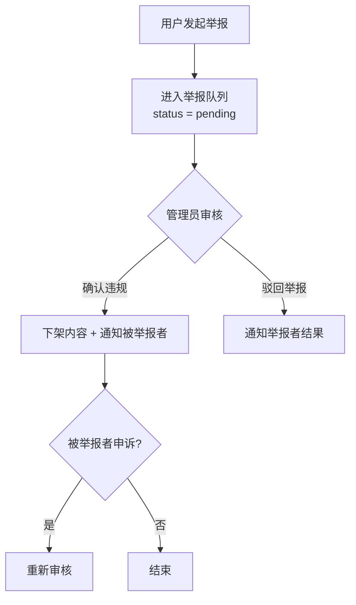

多次被举报的用户自动限制发布权限。

### 16.2 贡献者等级与徽章

| 等级 | 条件 | 特权 |
|------|------|------|
| 新手 (newcomer) | 注册即获得 | 基础功能 |
| 贡献者 (contributor) | 上传≥10个已审核纹案 | AI生成次数提升 |
| 专家 (expert) | 获赞≥100 + 专业审核 | 精华推荐权 |
| 认证传承人 (inheritor) | 官方认证 | 专属标识 + 全功能 |

徽章示例：“首次上传”、“百赞纹案”、“楚文化专家”、“地图探索家”等，通过 `user_badges` 表存储。

### 16.3 通知系统

通知触发场景：
- 评论被回复
- 纹案审核结果（通过/拒绝）
- 获得新徽章
- 举报处理结果
- 系统公告

技术实现：写入 `notifications` 表 + **前端轮询**（每 10 秒查询未读通知）推送实时更新到前端铃铛图标。后续可升级为 Socket.io 实时推送。

---

## 17. 合规、安全与无障碍

### 17.1 中国《个人信息保护法》(PIPL) 合规

**必须实现**：
- 数据收集知情同意弹窗（首次访问）
- 用户数据可导出 (`GET /api/users/me/export`)
- 用户数据可删除 (`DELETE /api/users/me/data`)
- 隐私政策页面公示 (`/privacy`)
- Cookie 使用声明

### 17.2 数据备份与灾难恢复

| 指标 | 目标值 |
|------|--------|
| RPO (恢复点目标) | < 24小时 |
| RTO (恢复时间目标) | < 4小时 |

- 数据库：Supabase 每日自动备份 + 手动异地备份
- 对象存储：开启跨区域复制

### 17.3 Web 无障碍 (a11y)

- 遵循 WCAG 2.1 AA 级标准
- 图片必须有 alt 文本描述
- 3D 场景提供纯文本替代展示
- 键盘可完整导航
- 色彩对比度达标

### 17.4 PWA 离线支持（Phase 3+）

- 配置 Service Worker，已浏览纹案可离线查看
- 支持“添加到主屏幕”
- 弱网环境下加载骨架屏

### 17.5 多语言国际化（Phase 4）

- 第一阶段：中文 + 英文双语
- 第二阶段：日文/韩文
- 使用 `next-intl` 实现，纹案名称和描述的翻译存储在独立的 `pattern_translations` 表

---

## 18. 项目分期路线图

### Phase 1：基础建设与 MVP

| 模块 | 交付物 |
|------|--------|
| 基础架构 | Next.js 16.2 初始化 + Supabase PostgreSQL 建库 + 18张表完整迁移 |
| 内容展示 | 纹案画廊（瀑布流/网格）+ 详情页 + 视频播放 |
| 地图页 | 3D 地图基础加载 + 标记点展示 + 缩放 |
| 用户系统 | 注册/登录 + 基础个人主页 |
| 收藏功能 | 收藏夹 CRUD |
| 版权标注 | 每个纹案强制标注版权 + 来源 |
| 合规页面 | 隐私政策 + 免责声明 + 同意弹窗 |
| 搜索 | 基础多维筛选面板 |
| DB 预留 | 知识图谱关系表结构预建 |

### Phase 2：视觉体验与社区

| 模块 | 交付物 |
|------|--------|
| 3D 地图 | 点击触发 3D 光晕 Shader 动画 + FlyTo + 详情浮窗 |
| 3D 文创 | 在线 3D 文创渲染预览器 (Three.js + R3F) |
| 演化时间线 | 纹案演化可视化 + 关系图谱 |
| 通知系统 | 站内通知 + 实时推送 |
| 个人主页 | 完整贡献统计 + 徽章展示 |
| 个性化推荐 | “你可能喜欢” + 每日精选 + 热门榜 |
| 后台统计 | 多维数据面板（流量/内容/用户/AI/社区） |
| 水印保护 | 可见水印 + 隐形水印 + 反爬虫 |
| 手机端适配 | H5 全面响应式 + 手势优化 |

### Phase 3：AI 深化与治理

| 模块 | 交付物 |
|------|--------|
| AI 图案生成 | SDXL + LoRA 训练 + 部署 + 前端交互 |
| 以图搜图 | CLIP 向量嵌入 + pgvector 检索 |
| AI 审核 | 文本+图片自动审核流水线 |
| 举报系统 | 举报→审核→申诉完整流程 |
| 贡献等级 | 积分体系 + 徽章系统 + 贡献者分级 |
| 非遗关联 | 纹案与非遗名录对接 |
| PWA | 离线支持 + 添加到主屏 |

### Phase 4：生态扩展

| 模块 | 交付物 |
|------|--------|
| 多语言 | 中文 + 英文双语 |
| Deep Zoom | 亿级像素超高清查看器 |
| 教育模块 | 互动课程 + 知识问答 + 学术引用导出 |
| 文创电商 | 定制下单入口 + 对接第三方平台 |
| 数据授权 | 分级授权体系（学术免费/商用付费）|
| 开放 API | 开发者文档 + API Key 管理 + 速率限制 |

---

## 19. 技术选型对比与决策记录

### 19.1 关键技术决策总表

| # | 决策点 | 选择 | 备选方案 | 核心理由 |
|:---:|--------|------|----------|----------|
| 1 | 前端框架 | **Next.js 16.2 (App Router)** | Nuxt.js / Vite SPA | SSR+SEO+R3F生态，规避 15.x CVE 漏洞 |
| 2 | 样式方案 | **Tailwind v4.2.2 + Motion v12** | CSS Modules + GSAP | 开发效率+声明式动画 |
| 3 | 状态管理 | **Zustand + TanStack Query** | Redux / Jotai | 轻量+缓存自动管理 |
| 4 | 3D 渲染 | **Three.js (React Three Fiber)** | Babylon.js | React 原生集成 |
| 5 | 地图引擎 | **高德地图 + Deck.gl** | Mapbox / Leaflet | 合规+3D效果 |
| 6 | 后端框架 | **Next.js API Routes (BFF)** | Express.js / Koa | 统一部署，无需独立后端 |
| 7 | AI 服务 | **火山引擎/豆包 API** | 自建GPU / OpenAI | 零GPU成本+国内合规+按次计费 |
| 8 | 数据库 | **Supabase PostgreSQL** | MySQL / Supabase | 国内同地域内网<1ms+PostGIS |
| 9 | 对象存储 | **阿里云 OSS** | Supabase Storage / 七牛 | 国内CDN+图片处理+签名URL |
| 10 | 图像生成 | **豆包 Seedream 5.0 API** | Midjourney / DALL-E | 0.22元/张，国内直连 |
| 11 | 模型精调 | **火山方舟 LoRA 精调** | 自建训练 | 云端训练，无需本地GPU |
| 12 | 内容审核 | **豆包大模型 2.0 多模态** | 百度审核 / 自建 | 文本+图片一站式审核 |
| 13 | 认证方案 | **NextAuth.js** | Supabase Auth / 自建 | 数据全在国内+零成本 |
| 14 | 缓存 | **阿里云 Redis** | 自建 Redis | 零运维+内网互通 |
| 15 | 向量检索 | **pgvector (PostgreSQL)** | Pinecone / Milvus | 无需额外服务 |
| 16 | 图像理解 | **豆包视觉理解模型** | CLIP 自建 | 以图搜图/色彩提取 |
| 17 | 水印方案 | **Canvas 叠加 + DCT 域嵌入** | 三方服务 | 自主可控+零成本 |
| 18 | 通知推送 | **轮询（初期）/ Socket.io** | Supabase Realtime | 无额外依赖，可渐进升级 |

---

## 20. AI 方案 — 基于豆包/火山引擎（零 GPU 方案）

> [!IMPORTANT]
> **核心决策：全部 AI 能力通过火山引擎 API 按次调用，不自建 GPU 服务器。**
> 成本模式从「固定月租 800-2000 元/月」变为「用多少付多少」，初期几乎零成本。

### 20.1 AI 功能与豆包模型映射总表

| # | AI 功能 | 调用的豆包模型 | 计费方式 | 单次成本估算 | 调用时机 |
|:---:|---------|--------------|----------|:---:|----------|
| 1 | **纹绣图案生成** | Seedream 5.0 Lite (doubao-seedream-5.0-lite) | 按张计费 | **~0.22元/张** | 用户点击「AI生成纹绣」 |
| 2 | **文本内容审核** | 豆包大模型 2.0 / 1.6 Lite | 按 Token 计费 | **~0.001元/条** | 用户发表评论/上传描述时 |
| 3 | **图片内容审核** | 豆包视觉理解 (Doubao-Seed-Vision) | 按 Token 计费 | **~0.003元/张** | 用户上传纹绣图片时 |
| 4 | **以图搜图（向量嵌入）** | 豆包视觉理解模型 | 按 Token 计费 | **~0.003元/张** | 上传图片搜索 + 新纹案入库时 |
| 5 | **色彩提取分析** | 前端 Canvas + 后端简单算法 | 免费（自建） | **0 元** | 纹案入库时自动提取 |
| 6 | **3D 文创纹理映射** | 前端 Three.js | 免费（纯前端） | **0 元** | 用户在3D预览器中操作 |
| 7 | **AI 辅助知识图谱** | 豆包大模型 2.0 | 按 Token 计费 | **~0.01元/次** | 管理员建立纹案关联时辅助 |

### 20.2 各功能详细实现方案

#### ① 纹绣图案生成（核心 AI 功能）

**模型选择**: `doubao-seedream-5.0-lite`（0.22元/张）或 `doubao-seedream-4.5`（0.25元/张）

**调用流程**:
```
用户输入描述 → Next.js API Route → 调用火山引擎 Seedream API → 返回图片 URL → 存入阿里云 OSS
```

**API 调用示例**:
```typescript
// app/api/ai/generate/route.ts
import { NextRequest, NextResponse } from 'next/server'

export async function POST(req: NextRequest) {
  const { prompt, style } = await req.json()
  
  const response = await fetch('https://visual.volcengineapi.com/v1/images/generations', {
    method: 'POST',
    headers: {
      'Content-Type': 'application/json',
      'Authorization': `Bearer ${process.env.VOLCENGINE_API_KEY}`
    },
    body: JSON.stringify({
      model: 'doubao-seedream-5.0-lite',
      prompt: `湖北传统纹绣图案, ${style}风格, ${prompt}, 高清, 传统文化`,
      size: '1024x1024',
      n: 1
    })
  })
  
  const data = await response.json()
  // 存入阿里云 OSS 并记录到 ai_tasks 表
  return NextResponse.json({ imageUrl: data.data[0].url })
}
```

**用量限制**: 普通用户每日 5 次，贡献者 20 次，专家无限制。

#### ② 文本内容审核

**模型选择**: `doubao-1.6-lite`（0.15元/百万Token，约 0.001 元/条评论）

**调用时机**: 用户发表评论、上传纹案描述时自动触发。

**Prompt 模板**:
```
你是一个内容安全审核员。请判断以下用户输入是否包含: 1)色情低俗 2)政治敏感 3)人身攻击 4)虚假信息 5)广告垃圾。
仅返回 JSON: {"safe": true/false, "reason": "原因"}

用户输入：{content}
```

#### ③ 图片内容审核

**模型选择**: `doubao-seed-vision`（视觉理解，0.4元/百万Token，约 0.003 元/张）

**调用时机**: 用户上传纹绣图片时。

**审核内容**: NSFW 检测 + 是否为有效纹绣图案（而非随意图片）。

#### ④ 以图搜图

**技术路径**:
1. 用户上传图片 → 调用豆包视觉理解模型提取图像特征描述
2. 将特征描述转化为向量（通过文本 embedding 端点）
3. 存入 PostgreSQL pgvector 字段
4. 搜索时做余弦相似度检索

**备选方案**: 如果豆包视觉理解模型的向量提取效果不理想，可改用开源 CLIP 模型在服务器 CPU 上运行（ViT-B/32 在 CPU 上单张推理约 200ms，可接受）。

#### ⑤ 色彩提取

**纯前端/后端自建方案**（不调用 API，零成本）:
```typescript
// 使用 Canvas 提取主色调
function extractColors(imageUrl: string, k: number = 5): string[] {
  // 1. 将图片绘制到 Canvas
  // 2. 获取像素数据
  // 3. k-means 聚类提取主色调
  // 4. 返回 HEX 色值数组
}
```

也可以用 npm 包 `colorthief` 或 `node-vibrant` 在服务端完成。

#### ⑥ 3D 文创纹理映射

**纯前端方案**（不需要任何 AI API）:
- Three.js + React Three Fiber 在浏览器端实时渲染
- 将 2D 纹绣图案作为 Texture 贴到预置 3D 模型的 UV 映射面上
- 详见文档第 6 章

### 20.3 火山方舟 LoRA 精调 — 训练专属纹绣模型

> [!NOTE]
> **火山方舟平台支持在线 LoRA 精调**，无需本地 GPU！
> 可以在火山方舟控制台上传纹绣数据集，云端完成微调训练。

**训练路径**:
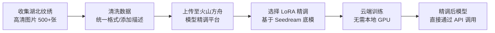

**火山方舟精调能力**:
- **支持方式**: SFT（有监督微调）、LoRA 精调、QLoRA
- **精调计费**: 约 40 元/百万 Token（文本模型），图像模型按训练时长计费
- **精调后推理**: 价格约为基础模型的 2~2.5 倍
- **操作方式**: 在火山方舟控制台可视化界面操作，上传数据集 → 选择底模 → 配置参数 → 启动训练

**注意**: 目前火山方舟的图像模型（Seedream）精调能力需确认是否已开放。如果图像精调暂未开放，替代方案为：
1. 先用基础 Seedream 模型 + 精心设计的 Prompt 工程（在 Prompt 中详细描述湖北纹绣特征）
2. 等火山方舟开放图像精调后再训练专属模型
3. 备选：使用 AutoDL 等按时租用 GPU（约 2 元/小时），训练完后释放，仅在训练时产生成本

### 20.4 成本估算（月度）

| 场景 | 假设用量 | 月成本估算 |
|------|----------|:---:|
| 纹绣图案生成 | 每日 50 次 × 30 天 = 1500 张 | **~330 元** |
| 文本审核 | 每日 200 条 × 30 天 = 6000 条 | **~6 元** |
| 图片审核 | 每日 30 张 × 30 天 = 900 张 | **~3 元** |
| 以图搜图 | 每日 20 次 × 30 天 = 600 次 | **~2 元** |
| 色彩提取 | 自建算法 | **0 元** |
| 3D 文创预览 | 前端渲染 | **0 元** |
| **月度 AI 总成本** | | **≈ 341 元** |

> 对比自建 GPU 服务器月租 800-2000 元，API 方案在初期用量下 **节省 60%~80%**。
> 且初期用户量少时成本更低——如果每天只有 10 次生成，月成本仅 66 元。

### 20.5 异步任务处理（无 Celery 方案）

由于不再有独立 Python 后端，AI 异步任务改为 **前端轮询模式**：

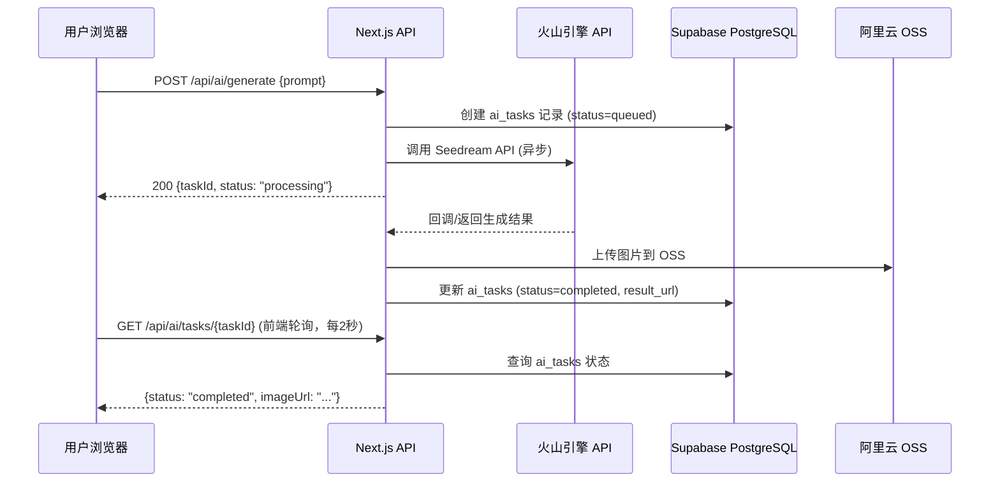

> 如果火山引擎 API 响应足够快（<10秒），也可以直接同步等待返回，无需轮询。
